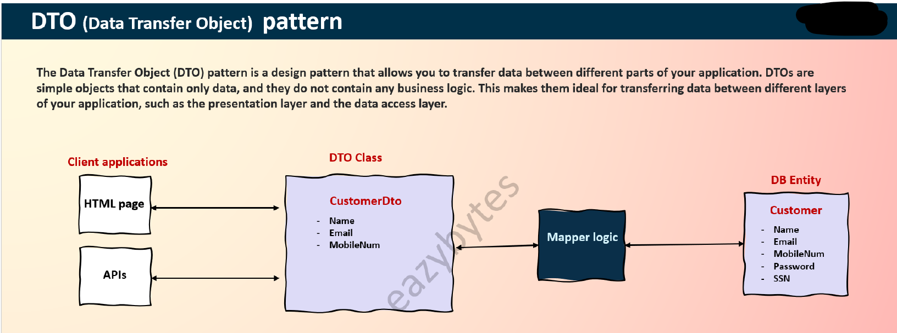
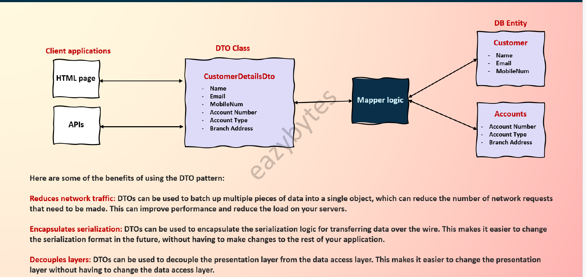
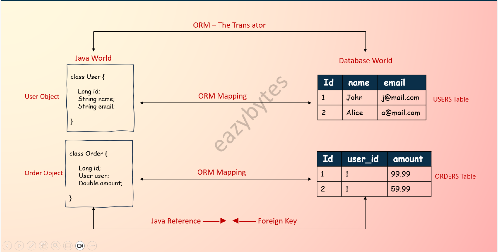

# Spring Boot – Complete Notes

---

## Table of Contents

- [Spring Boot – Complete Notes](#spring-boot--complete-notes)
  - [Table of Contents](#table-of-contents)
- [1. What is Spring Boot?](#1-what-is-spring-boot)
  - [1.1 Key Features of Spring Boot](#11-key-features-of-spring-boot)
    - [1. Auto-Configuration](#1-auto-configuration)
    - [2. Standalone Applications](#2-standalone-applications)
    - [3. Starter Dependencies (Starter POMs)](#3-starter-dependencies-starter-poms)
    - [4. No XML Configuration](#4-no-xml-configuration)
    - [5. Production-Ready Features](#5-production-ready-features)
  - [1.2 Why Use Spring Boot?](#12-why-use-spring-boot)
  - [1.3 Example: Simple Spring Boot Application](#13-example-simple-spring-boot-application)
- [2. Spring Boot vs. Spring Framework: Key Differences](#2-spring-boot-vs-spring-framework-key-differences)
  - [2.1 Overview](#21-overview)
  - [2.2 Key Differences Explained](#22-key-differences-explained)
    - [A. Configuration Approach](#a-configuration-approach)
    - [B. Project Setup](#b-project-setup)
    - [C. Development Speed](#c-development-speed)
    - [D. Production Features](#d-production-features)
  - [2.3 When to Use Which?](#23-when-to-use-which)
    - [Choose Spring Framework When:](#choose-spring-framework-when)
    - [Choose Spring Boot When:](#choose-spring-boot-when)
  - [2.4 Code Comparison](#24-code-comparison)
    - [Spring Framework (Web App)](#spring-framework-web-app)
    - [Spring Boot (Web App)](#spring-boot-web-app)
- [3. Internal Working of Spring Boot](#3-internal-working-of-spring-boot)
  - [3.1 What Happens When We Start a Spring Boot Application?](#31-what-happens-when-we-start-a-spring-boot-application)
  - [3.2 Step-by-Step Breakdown](#32-step-by-step-breakdown)
    - [Step 1: `@SpringBootApplication` — The Core Annotation](#step-1-springbootapplication--the-core-annotation)
    - [Step 2: `SpringApplication.run()` Method](#step-2-springapplicationrun-method)
    - [Step 3: Auto-Configuration in Detail](#step-3-auto-configuration-in-detail)
    - [Step 4: Bean Creation and Dependency Injection](#step-4-bean-creation-and-dependency-injection)
    - [Step 5: Embedded Server Startup](#step-5-embedded-server-startup)
    - [Step 6: Application Events and Listeners](#step-6-application-events-and-listeners)
    - [Step 7: Running CommandLineRunner / ApplicationRunner](#step-7-running-commandlinerunner--applicationrunner)
    - [Step 8: Application Ready!](#step-8-application-ready)
  - [3.3 Complete Summary (Interview-Friendly)](#33-complete-summary-interview-friendly)
  - [3.4 Internal Flow Diagram](#34-internal-flow-diagram)
- [4. Spring Boot Architecture: Deep Dive](#4-spring-boot-architecture-deep-dive)
  - [4.1 Overview of Spring Boot Architecture](#41-overview-of-spring-boot-architecture)
  - [4.2 Architectural Layers](#42-architectural-layers)
    - [A. Presentation Layer](#a-presentation-layer)
    - [B. Business Layer](#b-business-layer)
    - [C. Data Access Layer](#c-data-access-layer)
    - [D. Integration Layer](#d-integration-layer)
  - [4.3 Core Architectural Components](#43-core-architectural-components)
    - [1. Spring Boot Starter](#1-spring-boot-starter)
    - [2. Auto-Configuration](#2-auto-configuration)
    - [3. Embedded Server](#3-embedded-server)
    - [4. Spring Boot Actuator](#4-spring-boot-actuator)
  - [4.4 Flow of Request Processing](#44-flow-of-request-processing)
  - [4.5 Configuration Architecture](#45-configuration-architecture)
  - [4.6 Spring Boot vs Traditional Architecture](#46-spring-boot-vs-traditional-architecture)
  - [4.7 Best Practices](#47-best-practices)
- [5. Annotations](#5-annotations)
  - [5.1 Core Spring Annotations](#51-core-spring-annotations)
  - [5.2 Spring Boot Annotations](#52-spring-boot-annotations)
  - [5.3 Web and REST Annotations (Spring MVC)](#53-web-and-rest-annotations-spring-mvc)
  - [5.4 Spring Data JPA Annotations](#54-spring-data-jpa-annotations)
  - [5.5 Spring Security Annotations](#55-spring-security-annotations)
  - [5.6 Testing Annotations](#56-testing-annotations)
  - [5.7 Other Useful Annotations](#57-other-useful-annotations)
  - [5.8 Spring Boot Annotations – Detailed Explanation](#58-spring-boot-annotations--detailed-explanation)
    - [🔹 1. `@SpringBootApplication`](#-1-springbootapplication)
    - [🔹 2. `@EnableAutoConfiguration`](#-2-enableautoconfiguration)
    - [🔹 3. `@ComponentScan`](#-3-componentscan)
    - [🔹 4. `@SpringBootTest`](#-4-springboottest)
    - [🔹 5. `@EnableConfigurationProperties`](#-5-enableconfigurationproperties)
    - [🔹 6. `@ConfigurationProperties`](#-6-configurationproperties)
    - [🔹 7. `@RestControllerAdvice`](#-7-restcontrolleradvice)
    - [🔹 8. `@SpringApplicationConfiguration` (Deprecated)](#-8-springapplicationconfiguration-deprecated)
    - [Summary Table](#summary-table)
  - [5.9 Core Spring Annotations – Detailed Explanation](#59-core-spring-annotations--detailed-explanation)
    - [🔹 1. `@Configuration`](#-1-configuration)
    - [🔹 2. `@Bean`](#-2-bean)
    - [🔹 3. `@Component`](#-3-component)
    - [🔹 4. `@Service`](#-4-service)
    - [🔹 5. `@Repository`](#-5-repository)
    - [🔹 6. `@Autowired`](#-6-autowired)
    - [🔹 7. `@Qualifier`](#-7-qualifier)
    - [🔹 8. `@Value`](#-8-value)
    - [🔹 9. `@Primary`](#-9-primary)
    - [🔹 10. `@Lazy`](#-10-lazy)
    - [🔹 11. `@DependsOn`](#-11-dependson)
    - [🔹 12. `@Scope`](#-12-scope)
  - [5.10 Web and REST Annotations – Detailed Explanation](#510-web-and-rest-annotations--detailed-explanation)
    - [🔹 `@Controller`](#-controller)
    - [🔹 `@RestController`](#-restcontroller)
    - [🔹 `@RequestMapping`](#-requestmapping)
    - [🔹 `@GetMapping`, `@PostMapping`, `@PutMapping`, `@DeleteMapping`, `@PatchMapping`](#-getmapping-postmapping-putmapping-deletemapping-patchmapping)
    - [🔹 `@PathVariable`](#-pathvariable)
    - [🔹 `@RequestParam`](#-requestparam)
    - [🔹 `@RequestBody`](#-requestbody)
    - [🔹 `@ResponseBody`](#-responsebody)
    - [🔹 `@ResponseStatus`](#-responsestatus)
    - [🔹 `@RequestHeader`](#-requestheader)
    - [🔹 `@CookieValue`](#-cookievalue)
  - [5.11 API Versioning in Spring Boot](#511-api-versioning-in-spring-boot)
    - [What is API Versioning?](#what-is-api-versioning)
    - [Why Do You Need It?](#why-do-you-need-it)
    - [The 4 Common Strategies](#the-4-common-strategies)
      - [1. URI Path Versioning ✅ Most Popular](#1-uri-path-versioning--most-popular)
      - [2. Request Parameter Versioning](#2-request-parameter-versioning)
      - [3. Header Versioning](#3-header-versioning)
      - [4. Media Type (Accept Header) Versioning](#4-media-type-accept-header-versioning)
    - [Quick Comparison](#quick-comparison)
    - [Best Practices](#best-practices)
    - [Simple Rule of Thumb](#simple-rule-of-thumb)
- [6. POJOs, JavaBeans, DTOs, DAOs, Value Objects, and Mappers](#6-pojos-javabeans-dtos-daos-value-objects-and-mappers)
  - [6.1 POJO (Plain Old Java Object)](#61-pojo-plain-old-java-object)
  - [6.2 JavaBean](#62-javabean)
  - [6.3 DTO (Data Transfer Object)](#63-dto-data-transfer-object)
  - [6.4 DAO (Data Access Object)](#64-dao-data-access-object)
  - [6.5 Value Object (VO)](#65-value-object-vo)
  - [6.6 Mapper](#66-mapper)
  - [6.7 Summary Table](#67-summary-table)
- [7. Spring Data JPA](#7-spring-data-jpa)
  - [7.1 Overview](#71-overview)
  - [7.2 How Spring Data JPA and Hibernate are related?](#72-how-spring-data-jpa-and-hibernate-are-related)
    - [JPA (Java Persistence API)](#jpa-java-persistence-api)
    - [Hibernate](#hibernate)
    - [Spring Data JPA](#spring-data-jpa)
    - [🧠 Key Idea](#-key-idea)
    - [Summary Table](#summary-table-1)
    - [Relationship Flow](#relationship-flow)
  - [7.3 What is ORM Framework?](#73-what-is-orm-framework)
    - [The Problem ORM Solves](#the-problem-orm-solves)
      - [The Mismatch:](#the-mismatch)
    - [Simple Benefits:](#simple-benefits)
    - [ORM – The Translator](#orm--the-translator)
      - [Java World ↔ Database World](#java-world--database-world)
        - [User Object → USERS Table](#user-object--users-table)
        - [Order Object → ORDERS Table](#order-object--orders-table)
  - [7.4 Entity, Repository, CrudRepository, JpaRepository](#74-entity-repository-crudrepository-jparepository)
    - [`@Entity`](#entity)
    - [Repository Hierarchy](#repository-hierarchy)
  - [7.5 JPQL and Native Queries](#75-jpql-and-native-queries)
    - [JPQL (Java Persistence Query Language)](#jpql-java-persistence-query-language)
    - [Native SQL](#native-sql)
  - [7.6 Database Configuration](#76-database-configuration)
    - [H2 (In-memory database, great for dev/test)](#h2-in-memory-database-great-for-devtest)
    - [MySQL / PostgreSQL Example](#mysql--postgresql-example)
  - [7.7 Spring Boot with Hibernate](#77-spring-boot-with-hibernate)
  - [7.8 DTOs and Model Mapping](#78-dtos-and-model-mapping)
    - [Why Use DTOs (Data Transfer Objects)?](#why-use-dtos-data-transfer-objects)
    - [Mapping Entity to DTO (Manual)](#mapping-entity-to-dto-manual)
    - [Using ModelMapper (Optional)](#using-modelmapper-optional)
  - [7.9 Summary Table](#79-summary-table)
  - [7.10 Spring Data JPA Annotations – Detailed Explanation](#710-spring-data-jpa-annotations--detailed-explanation)
    - [🔹 `@Entity`](#-entity)
    - [🔹 `@Id`](#-id)
    - [🔹 `@GeneratedValue`](#-generatedvalue)
    - [🔹 `@Table`](#-table)
    - [🔹 `@Column`](#-column)
    - [🔹 `@OneToOne`](#-onetoone)
    - [🔹 `@OneToMany`](#-onetomany)
    - [🔹 `@ManyToOne`](#-manytoone)
    - [🔹 `@ManyToMany`](#-manytomany)
    - [🔹 `@JoinColumn`](#-joincolumn)
    - [🔹 `@Repository`](#-repository)
- [8. Logging in Spring Boot](#8-logging-in-spring-boot)
  - [8.1 What is Logging?](#81-what-is-logging)
  - [8.2 Key Benefits of Logging](#82-key-benefits-of-logging)
  - [8.3 Why Not Use `System.out.println()`](#83-why-not-use-systemoutprintln)
  - [8.4 SLF4J and Logging Frameworks](#84-slf4j-and-logging-frameworks)
  - [8.5 Default Log Format](#85-default-log-format)
  - [8.6 Formatting Logs (Pattern Configuration)](#86-formatting-logs-pattern-configuration)
  - [8.7 Log Levels in Spring Boot](#87-log-levels-in-spring-boot)
  - [8.8 Changing Log Levels in `application.properties`](#88-changing-log-levels-in-applicationproperties)
  - [8.9 File Logging and JSON Logs](#89-file-logging-and-json-logs)
  - [8.10 Logging Example (SLF4J)](#810-logging-example-slf4j)
  - [8.11 Logging Example with Lombok](#811-logging-example-with-lombok)
- [9. Spring Profiles](#9-spring-profiles)
  - [9.1 What is a Spring Profile?](#91-what-is-a-spring-profile)
  - [9.2 Common Use Cases](#92-common-use-cases)
  - [9.3 How to Define a Profile](#93-how-to-define-a-profile)
    - [1. `application.properties/yml` files](#1-applicationpropertiesyml-files)
    - [2. `application.yml` example](#2-applicationyml-example)
  - [9.4 Activating a Profile](#94-activating-a-profile)
    - [1. In application.properties](#1-in-applicationproperties)
    - [2. As a command-line argument](#2-as-a-command-line-argument)
    - [3. As an environment variable](#3-as-an-environment-variable)
    - [4. In application code](#4-in-application-code)
  - [9.5 Profile-specific Beans](#95-profile-specific-beans)
    - [`@Profile` on Classes](#profile-on-classes)
  - [9.6 Checking Active Profile at Runtime](#96-checking-active-profile-at-runtime)
  - [9.7 Why Use Spring Profiles?](#97-why-use-spring-profiles)
  - [9.8 How Spring Resolves Profiles](#98-how-spring-resolves-profiles)
  - [9.9 Best Practices](#99-best-practices)
- [10. How to Read Properties in Spring Boot](#10-how-to-read-properties-in-spring-boot)
  - [10.1 Using `@Value` Annotation](#101-using-value-annotation)
  - [10.2 Using `Environment` Interface](#102-using-environment-interface)
  - [10.3 Using `@ConfigurationProperties`](#103-using-configurationproperties)
  - [10.4 Summary Table](#104-summary-table)
- [11. Configuration Properties (Deep Dive)](#11-configuration-properties-deep-dive)
  - [11.1 `@ConfigurationProperties`](#111-configurationproperties)
  - [11.2 `@EnableConfigurationProperties`](#112-enableconfigurationproperties)
  - [11.3 Summary](#113-summary)
- [12. IoC Container in Spring](#12-ioc-container-in-spring)
  - [12.1 What is IoC (Inversion of Control)?](#121-what-is-ioc-inversion-of-control)
  - [12.2 What is the IoC Container?](#122-what-is-the-ioc-container)
  - [12.3 Types of IoC Containers in Spring](#123-types-of-ioc-containers-in-spring)
  - [12.4 How It Works](#124-how-it-works)
  - [12.5 Example: Using IoC Container](#125-example-using-ioc-container)
    - [Component Classes](#component-classes)
    - [Main Application](#main-application)
  - [12.6 Benefits of IoC Container](#126-benefits-of-ioc-container)
- [13. Spring Exception Handling](#13-spring-exception-handling)
  - [13.1 Why Use Exception Handling in Spring?](#131-why-use-exception-handling-in-spring)
  - [13.2 Types of Exception Handling in Spring](#132-types-of-exception-handling-in-spring)
  - [13.3 Basic Example with `@ExceptionHandler`](#133-basic-example-with-exceptionhandler)
  - [13.4 Global Exception Handling with `@ControllerAdvice`](#134-global-exception-handling-with-controlleradvice)
  - [13.5 Using `@ResponseStatus` on Custom Exceptions](#135-using-responsestatus-on-custom-exceptions)
  - [13.6 Returning Error Details as Object](#136-returning-error-details-as-object)
  - [13.7 Best Practices](#137-best-practices)
  - [13.8 Summary](#138-summary)

---

# 1. What is Spring Boot?

**Spring Boot** is an open-source, Java-based framework designed to simplify the development of **standalone, production-ready Spring applications** with minimal configuration. It is built on top of the **Spring Framework** and follows the principle of **"Convention over Configuration"**, reducing boilerplate code and allowing developers to focus on business logic rather than setup and infrastructure.

---

## 1.1 Key Features of Spring Boot

### 1. Auto-Configuration
- Automatically configures Spring and third-party libraries based on **dependencies** in the classpath.
- Example: If `spring-boot-starter-data-jpa` is added, Spring Boot auto-configures **Hibernate, DataSource, and JPA**.

### 2. Standalone Applications
- **No need for external servers** (like Tomcat).
- Comes with **embedded servers** (Tomcat, Jetty, or Undertow).
- Runs as a **self-contained JAR** (Java Archive) with `java -jar`.

### 3. Starter Dependencies (Starter POMs)
- Simplifies dependency management (e.g., `spring-boot-starter-web` includes Spring MVC, Tomcat, and JSON support).
- Avoids version conflicts.

### 4. No XML Configuration
- Uses **Java-based annotations** (`@SpringBootApplication`) instead of XML.

### 5. Production-Ready Features
- **Spring Boot Actuator** → Provides monitoring (health checks, metrics, logs).
- **Externalized Configuration** → Supports `.properties` and `.yml` files.
- **Logging** → Built-in support for **Logback, SLF4J**.

---

## 1.2 Why Use Spring Boot?

| **Before Spring Boot** | **With Spring Boot** |
|------------------------|----------------------|
| Manual XML/Java Config (`applicationContext.xml`) | **Auto-Configuration** (Zero config) |
| Manually add dependencies (risk of conflicts) | **Starter POMs** (Pre-defined dependencies) |
| Deploy WAR on external servers (Tomcat) | **Embedded Server** (Self-contained JAR) |
| Slow setup, more boilerplate code | **Faster development** (Focus on business logic) |

---

## 1.3 Example: Simple Spring Boot Application

```java
@SpringBootApplication  // Auto-config + Component Scan
public class MyApp {
    public static void main(String[] args) {
        SpringApplication.run(MyApp.class, args); // Starts embedded server
    }
}

@RestController
class HelloController {
    @GetMapping("/hello")
    public String sayHello() {
        return "Hello, Spring Boot!";
    }
}
```
- Just **one class** with `@SpringBootApplication` → Runs a full REST API!
- No `web.xml`, no server setup.

---

# 2. Spring Boot vs. Spring Framework: Key Differences

## 2.1 Overview

| Feature          | Spring Framework | Spring Boot |
|-----------------|----------------|-------------|
| **Purpose** | Core framework for dependency injection, AOP, MVC | Opinionated extension of Spring for rapid app development |
| **Configuration** | Manual (XML/Java-based) | Auto-configuration |
| **Embedded Server** | No (requires external server) | Yes (Tomcat/Jetty/Undertow) |
| **Dependency Mgmt** | Manual | Starter POMs (pre-configured) |
| **Bootstrapping** | Complex setup | `@SpringBootApplication` (single annotation) |
| **Best For** | Flexible, fine-grained control | Rapid development, microservices |

---

## 2.2 Key Differences Explained

### A. Configuration Approach
- **Spring Framework**:
  - Requires explicit configuration (XML or `@Configuration` classes)
  - Example:
    ```xml
    <!-- Manual bean definition in XML -->
    <bean id="dataSource" class="org.springframework.jdbc.datasource.DriverManagerDataSource"/>
    ```

- **Spring Boot**:
  - **Auto-configures** beans based on classpath dependencies
  - Example: Just add `spring-boot-starter-data-jpa` → Auto-configures Hibernate!

### B. Project Setup
- **Spring Framework**:
  - Manual dependency management (risk of version conflicts)
  - Requires separate server deployment (WAR files)

- **Spring Boot**:
  - **Starter dependencies** (e.g., `spring-boot-starter-web` bundles Spring MVC + Tomcat)
  - Embedded server → Runs as **self-contained JAR**

### C. Development Speed
- **Spring Framework**:
  ```java
  @Configuration
  @EnableWebMvc
  public class AppConfig implements WebMvcConfigurer {
      // Manual MVC configuration
  }
  ```

- **Spring Boot**:
  ```java
  @SpringBootApplication // Single annotation replaces all boilerplate
  public class MyApp {
      public static void main(String[] args) {
          SpringApplication.run(MyApp.class, args);
      }
  }
  ```

### D. Production Features

| Feature          | Spring Framework | Spring Boot |
|-----------------|----------------|-------------|
| **Actuator** | Not available | Built-in (health checks, metrics) |
| **Profiles** | Manual setup | Native support (`application-{profile}.yml`) |
| **Logging** | Manual configuration | Auto-configured (Logback/SLF4J) |

---

## 2.3 When to Use Which?

### Choose Spring Framework When:
- You need **full control** over configurations
- Working with **legacy systems** requiring XML
- Building **highly customized** architectures

### Choose Spring Boot When:
- Rapid prototyping or microservices development
- Avoiding boilerplate configuration
- Need **embedded servers** or **Actuator** for monitoring

---

## 2.4 Code Comparison

### Spring Framework (Web App)
```java
public class MyWebInitializer implements WebApplicationInitializer {
    @Override
    public void onStartup(ServletContext container) {
        AnnotationConfigWebApplicationContext context = new AnnotationConfigWebApplicationContext();
        context.register(AppConfig.class);
        container.addListener(new ContextLoaderListener(context));
        // Manual DispatcherServlet setup...
    }
}
```

### Spring Boot (Web App)
```java
@SpringBootApplication // Auto-configures EVERYTHING
public class MyApp {
    public static void main(String[] args) {
        SpringApplication.run(MyApp.class, args);
    }
}
```

---

# 3. Internal Working of Spring Boot

## 3.1 What Happens When We Start a Spring Boot Application?

You usually start your app with this:

```java
@SpringBootApplication
public class MyApplication {
    public static void main(String[] args) {
        SpringApplication.run(MyApplication.class, args);
    }
}
```

---

## 3.2 Step-by-Step Breakdown

### Step 1: `@SpringBootApplication` — The Core Annotation

This is actually a **combination of three annotations**:

```java
@SpringBootConfiguration      // Marks this class as a source of bean definitions (like @Configuration)
@EnableAutoConfiguration      // Enables Spring Boot's auto-configuration mechanism
@ComponentScan                // Enables component scanning in the current package and subpackages
```

> "Scan my package for components and automatically configure dependencies based on what's on the classpath."

---

### Step 2: `SpringApplication.run()` Method

This method is the **starting point of the entire Spring Boot lifecycle**.

Internally, it does these steps:

1. **Creates a SpringApplication instance**
   - Detects the application type (web, reactive, or CLI).
   - Sets up default environment variables and banner display.

2. **Prepares the ApplicationContext**
   - Creates the **IoC container** (ApplicationContext).
   - This is where all beans are created, managed, and wired together.

3. **Performs Classpath Scanning**
   - Finds classes annotated with `@Component`, `@Service`, `@Repository`, and `@Controller`.
   - Registers them as beans in the ApplicationContext.

4. **Triggers Auto-Configuration**
   - The `@EnableAutoConfiguration` annotation activates the **auto-configuration mechanism**.
   - It looks at the dependencies in your classpath (via `META-INF/spring/org.springframework.boot.autoconfigure.AutoConfiguration.imports`) and loads corresponding configurations.

   Example:
   - If `spring-boot-starter-web` is in your classpath → `DispatcherServlet`, `Tomcat`, and MVC config beans are auto-configured.
   - If `spring-boot-starter-data-jpa` is present → `EntityManager`, `DataSource`, and `JpaRepository` are auto-configured.

---

### Step 3: Auto-Configuration in Detail

This is one of Spring Boot's most powerful features. It works based on conditional annotations like:

```java
@Configuration
@ConditionalOnClass(DataSource.class)
public class DataSourceAutoConfiguration {
    @Bean
    public DataSource dataSource() {
        return new HikariDataSource();
    }
}
```

> "If a `DataSource` class exists on the classpath and you haven't defined your own, I'll create one for you."

This is how Boot removes the need for XML or manual bean configurations.

---

### Step 4: Bean Creation and Dependency Injection

Once auto-configuration and component scanning are done:

- The IoC container creates all beans.
- Dependencies are injected (`@Autowired`, constructor injection, etc.).
- Lifecycle methods like `@PostConstruct` or `InitializingBean` are executed.

All beans are now available in the **ApplicationContext**.

---

### Step 5: Embedded Server Startup

If it's a web application:

- Spring Boot **creates and starts an embedded server** (Tomcat by default).
- Registers the **DispatcherServlet**, which acts as the **front controller**.
- DispatcherServlet maps all HTTP requests to appropriate controllers.

So, when you hit `http://localhost:8080/hello`, the flow is:

```
Client → DispatcherServlet → Controller → Service → Repository → DB → Response
```

No external server setup needed — everything runs inside the same process.

---

### Step 6: Application Events and Listeners

Spring Boot publishes several events during startup:

- `ApplicationStartingEvent`
- `ApplicationPreparedEvent`
- `ApplicationReadyEvent`

You can listen to these using `ApplicationListener` or `@EventListener` if you want to run custom logic at specific stages.

---

### Step 7: Running CommandLineRunner / ApplicationRunner

After the context is fully loaded and the server is ready, Spring Boot executes all beans that implement `CommandLineRunner` or `ApplicationRunner`.

Example:

```java
@Component
public class StartupTask implements CommandLineRunner {
    @Override
    public void run(String... args) {
        System.out.println("App started successfully!");
    }
}
```

---

### Step 8: Application Ready!

At this point:

- The IoC container is fully initialized.
- Beans are created and injected.
- Auto-configuration is complete.
- The embedded web server is running and listening for requests.

You'll see logs like:

```
Tomcat started on port(s): 8080
Started MyApplication in 2.341 seconds
```

Your Spring Boot app is now fully operational 🎉

---

## 3.3 Complete Summary (Interview-Friendly)

> "When we run a Spring Boot application, the `@SpringBootApplication` annotation triggers component scanning and auto-configuration.
> The `SpringApplication.run()` method creates an IoC container (ApplicationContext), scans for beans, and injects dependencies.
> Then the `@EnableAutoConfiguration` mechanism looks at the classpath and automatically configures required beans like DataSource, DispatcherServlet, etc.
> If it's a web app, Spring Boot starts an embedded Tomcat server and registers DispatcherServlet as the front controller.
> Finally, the context is fully initialized, and the app is ready to handle requests.
> That's how Spring Boot internally sets up everything automatically without manual configuration."

---

## 3.4 Internal Flow Diagram

```
@SpringBootApplication
        │
        ▼
SpringApplication.run()
        │
        ▼
Creates ApplicationContext (IoC Container)
        │
        ▼
Component Scanning → Finds Beans
        │
        ▼
Auto-Configuration → Sets up DataSource, Web, Security, etc.
        │
        ▼
Bean Creation → Dependency Injection
        │
        ▼
Embedded Tomcat Starts
        │
        ▼
DispatcherServlet Initialized
        │
        ▼
Application Ready to Handle Requests
```

---

# 4. Spring Boot Architecture: Deep Dive

## 4.1 Overview of Spring Boot Architecture

Spring Boot follows a **layered architecture** built on top of the Spring Framework. Its key components work together to provide:
- **Auto-configuration** (Smart defaults)
- **Embedded server** (No external deployment)
- **Starter dependencies** (Simplified POMs)
- **Production-ready features** (Actuator, metrics)

---

## 4.2 Architectural Layers

### A. Presentation Layer
- **Components**: `@RestController`, `@Controller`
- **Responsibility**: Handles HTTP requests/responses
- **Example**:
  ```java
  @RestController
  public class UserController {
      @GetMapping("/users")
      public List<User> getUsers() {
          return userService.findAll();
      }
  }
  ```

### B. Business Layer
- **Components**: `@Service`, `@Component`
- **Responsibility**: Contains business logic
- **Example**:
  ```java
  @Service
  public class UserService {
      @Autowired
      private UserRepository repo;

      public List<User> findAll() {
          return repo.findAll();
      }
  }
  ```

### C. Data Access Layer
- **Components**: `@Repository`, Spring Data JPA
- **Responsibility**: Database interactions
- **Example**:
  ```java
  @Repository
  public interface UserRepository extends JpaRepository<User, Long> {}
  ```

### D. Integration Layer
- Handles external systems (REST APIs, messaging queues)
- Common annotations: `@FeignClient`, `@KafkaListener`

---

## 4.3 Core Architectural Components

### 1. Spring Boot Starter
- **Purpose**: Simplified dependency management
- **How it works**:
  ```xml
  <dependency>
      <groupId>org.springframework.boot</groupId>
      <artifactId>spring-boot-starter-web</artifactId>
  </dependency>
  ```
  - Bundles Tomcat + Spring MVC + JSON support

### 2. Auto-Configuration
- **Mechanism**:
  1. Scans classpath
  2. Checks `META-INF/spring/org.springframework.boot.autoconfigure.AutoConfiguration.imports`
  3. Applies defaults
- **Example**: Adding `spring-boot-starter-data-jpa` auto-configures:
  - DataSource
  - Hibernate
  - JPA EntityManager

### 3. Embedded Server
- **Options**: Tomcat (default), Jetty, Undertow
- **How it works**:
  ```java
  @SpringBootApplication
  public class App {
      public static void main(String[] args) {
          // Starts embedded server on port 8080
          SpringApplication.run(App.class, args);
      }
  }
  ```

### 4. Spring Boot Actuator
- **Production monitoring**:
  ```yaml
  management:
    endpoints:
      web:
        exposure:
          include: health,info,metrics
  ```
- **Key endpoints**:
  - `/actuator/health` - Application health
  - `/actuator/metrics` - Performance metrics
  - `/actuator/env` - Environment variables

---

## 4.4 Flow of Request Processing

1. **HTTP Request** → DispatcherServlet (Auto-configured)
2. **Routes to Controller** via `@RequestMapping`
3. **Business Logic** processed in Service layer
4. **Data Access** via Repository
5. **Response** returned through Controller

---

## 4.5 Configuration Architecture

Spring Boot's **hierarchical** property loading order:
1. `@PropertySource` annotations
2. **application.properties** (or `.yml`)
3. OS environment variables
4. Command-line arguments

Example property override:
```properties
# application-dev.properties
server.port=8081
```

---

## 4.6 Spring Boot vs Traditional Architecture

| Aspect | Traditional Spring | Spring Boot |
|--------|-------------------|-------------|
| **Configuration** | Manual XML/Java | Auto-configured |
| **Deployment** | WAR on external server | Self-contained JAR |
| **Dependencies** | Manual version mgmt | Starter POMs |
| **Bootstrapping** | Multiple config files | Single `@SpringBootApplication` |

---

## 4.7 Best Practices

1. **Keep layered architecture** (Controller → Service → Repository)
2. **Use profiles** for environment-specific configs
3. **Leverage Actuator** for production monitoring
4. **Externalize configuration** (avoid hardcoding)

---

# 5. Annotations

## 5.1 Core Spring Annotations

| Annotation            | Purpose |
|------------------------|---------|
| `@Configuration`       | Marks a class as a source of bean definitions |
| `@Bean`                | Declares a bean manually within a configuration class |
| `@Component`           | Generic stereotype for any Spring-managed component |
| `@Service`             | Specialization of `@Component` for service layer |
| `@Repository`          | Specialization of `@Component` for persistence layer |
| `@Autowired`           | Injects dependencies automatically |
| `@Qualifier`           | Resolves conflicts when multiple beans of the same type exist |
| `@Value`               | Injects values from `application.properties` |
| `@Primary`             | Marks a bean as the default one when multiple candidates exist |
| `@Lazy`                | Initializes the bean lazily (on first use) |
| `@DependsOn`           | Specifies bean initialization order |
| `@Scope`               | Defines the scope of a bean (`singleton`, `prototype`, etc.) |

---

## 5.2 Spring Boot Annotations

| Annotation                | Purpose |
|----------------------------|---------|
| `@SpringBootApplication`   | Combines `@Configuration`, `@EnableAutoConfiguration`, and `@ComponentScan` |
| `@EnableAutoConfiguration` | Enables Spring Boot's auto-configuration feature |
| `@ComponentScan`           | Tells Spring to scan for annotated components in a package |
| `@SpringBootTest`          | Used for Spring Boot integration tests |
| `@EnableConfigurationProperties` | Binds configuration properties to Java beans |
| `@ConfigurationProperties` | Maps multiple properties from `application.properties` to a POJO |
| `@RestControllerAdvice`    | Global exception handling for REST controllers |
| `@SpringApplicationConfiguration` | Used in older Spring Boot versions for test config |

---

## 5.3 Web and REST Annotations (Spring MVC)

| Annotation          | Purpose |
|----------------------|---------|
| `@Controller`        | Marks a class as a web controller (returns views) |
| `@RestController`    | Combines `@Controller` + `@ResponseBody` (returns data, not views) |
| `@RequestMapping`    | Maps HTTP requests to controller classes/methods |
| `@GetMapping`        | Shortcut for `@RequestMapping(method = RequestMethod.GET)` |
| `@PostMapping`       | Shortcut for POST |
| `@PutMapping`        | Shortcut for PUT |
| `@DeleteMapping`     | Shortcut for DELETE |
| `@PatchMapping`      | Shortcut for PATCH |
| `@PathVariable`      | Binds a URI variable to a method parameter |
| `@RequestParam`      | Binds query parameters to method arguments |
| `@RequestBody`       | Binds the request body to a method parameter |
| `@ResponseBody`      | Sends return values directly as HTTP responses |
| `@ResponseStatus`    | Sets the HTTP status for a method |
| `@RequestHeader`     | Injects request header values |
| `@CookieValue`       | Injects cookie values |

---

## 5.4 Spring Data JPA Annotations

| Annotation          | Purpose |
|----------------------|---------|
| `@Entity`            | Marks a class as a JPA entity |
| `@Id`                | Marks the primary key |
| `@GeneratedValue`    | Specifies how the primary key is generated |
| `@Table`             | Specifies the table name |
| `@Column`            | Specifies column details |
| `@OneToOne` / `@OneToMany` / `@ManyToOne` / `@ManyToMany` | Defines relationships between entities |
| `@JoinColumn`        | Defines foreign key column |
| `@Repository`        | Marks a Spring Data repository |

---

## 5.5 Spring Security Annotations

| Annotation              | Purpose |
|--------------------------|---------|
| `@EnableWebSecurity`     | Enables Spring Security config |
| `@PreAuthorize`          | Method-level security with expressions |
| `@Secured`               | Limits access to methods to specific roles |
| `@RolesAllowed`          | Same as above (Java EE style) |
| `@AuthenticationPrincipal` | Injects the current authenticated user |

---

## 5.6 Testing Annotations

| Annotation           | Purpose |
|-----------------------|---------|
| `@SpringBootTest`     | Integration testing |
| `@WebMvcTest`         | Tests only Spring MVC components |
| `@DataJpaTest`        | Tests only JPA components |
| `@MockBean`           | Creates and injects a mock bean |
| `@TestConfiguration`  | Custom configuration for testing |

---

## 5.7 Other Useful Annotations

| Annotation              | Purpose |
|--------------------------|---------|
| `@EnableScheduling`      | Enables scheduled tasks |
| `@Scheduled`             | Defines scheduled tasks |
| `@EnableAsync`           | Enables async method execution |
| `@Async`                 | Runs a method asynchronously |
| `@EnableCaching`         | Enables caching |
| `@Cacheable`             | Caches the method's return value |
| `@CacheEvict`            | Removes entry from cache |

---

## 5.8 Spring Boot Annotations – Detailed Explanation

### 🔹 1. `@SpringBootApplication`

**What It Does:**
This is the **main annotation** used to bootstrap a Spring Boot application. It combines:
- `@Configuration` — allows the class to define beans using `@Bean`
- `@EnableAutoConfiguration` — auto-configures Spring Beans based on the classpath and properties
- `@ComponentScan` — scans for Spring components in the current package and subpackages

**When to Use:** Always use this on your **main application class** (entry point).

**Example:**
```java
@SpringBootApplication
public class MyApp {
    public static void main(String[] args) {
        SpringApplication.run(MyApp.class, args);
    }
}
```

---

### 🔹 2. `@EnableAutoConfiguration`

**What It Does:**
Tells Spring Boot to **automatically configure beans** based on dependencies in your project (e.g., if `spring-boot-starter-web` is in the classpath, it sets up Tomcat, Jackson, etc.).

**When to Use:** Use it when you want **auto-configuration** but don't want to use `@SpringBootApplication`.

**Example:**
```java
@Configuration
@EnableAutoConfiguration
public class MyConfig {
    public static void main(String[] args) {
        SpringApplication.run(MyConfig.class, args);
    }
}
```

---

### 🔹 3. `@ComponentScan`

**What It Does:**
Tells Spring where to **look for components** (`@Component`, `@Service`, `@Repository`, etc.) to register as beans.

**When to Use:** When your components are outside the current package of the main class.

**Example:**
```java
@ComponentScan(basePackages = {"com.myapp.services", "com.myapp.controllers"})
public class AppConfig { }
```

---

### 🔹 4. `@SpringBootTest`

**What It Does:**
Used for **integration testing** in Spring Boot. Loads the full application context and allows you to test components as they work together.

**When to Use:** When you want to test the full Spring context.

**Example:**
```java
@SpringBootTest
class UserServiceTest {

    @Autowired
    private UserService userService;

    @Test
    void testGreeting() {
        assertEquals("Hello", userService.greet());
    }
}
```

---

### 🔹 5. `@EnableConfigurationProperties`

**What It Does:**
Enables support for `@ConfigurationProperties` annotated beans. Without this, Spring Boot won't map values from `application.properties`.

**When to Use:** Use when you want to **externalize configuration** into a POJO from properties/yaml.

**Example:**
```java
@SpringBootApplication
@EnableConfigurationProperties(AppConfig.class)
public class MyApp { }
```

---

### 🔹 6. `@ConfigurationProperties`

**What It Does:**
Maps hierarchical configuration properties (from `application.properties` or `application.yml`) to a Java bean.

**When to Use:** When you have **grouped or nested configuration** settings to bind to a class.

**Example:**
```properties
app.name=TestApp
app.version=1.0
```

```java
@Component
@ConfigurationProperties(prefix = "app")
public class AppConfig {
    private String name;
    private String version;

    // Getters and Setters
}
```

---

### 🔹 7. `@RestControllerAdvice`

**What It Does:**
It's a combination of `@ControllerAdvice` and `@ResponseBody`, used for **global exception handling** in REST controllers.

**When to Use:** Use when you want to handle exceptions from **all REST endpoints** in one place.

**Example:**
```java
@RestControllerAdvice
public class GlobalExceptionHandler {

    @ExceptionHandler(Exception.class)
    public ResponseEntity<String> handleException(Exception ex) {
        return new ResponseEntity<>("Something went wrong!", HttpStatus.INTERNAL_SERVER_ERROR);
    }
}
```

---

### 🔹 8. `@SpringApplicationConfiguration` (Deprecated)

**What It Did:**
Used in **older Spring Boot versions** to configure the application context for tests.

**When to Use:** ⚠️ **Deprecated** — no longer needed after Spring Boot 1.4. Use `@SpringBootTest` instead.

**Modern Alternative:**
```java
@SpringBootTest
public class MyAppTest {
    // test methods
}
```

---

### Summary Table

| Annotation                  | Use Case |
|-----------------------------|----------|
| `@SpringBootApplication`     | Main entry point of Spring Boot app |
| `@EnableAutoConfiguration`   | Enables auto setup of beans based on dependencies |
| `@ComponentScan`             | Scans packages for Spring components |
| `@SpringBootTest`            | Full integration testing |
| `@EnableConfigurationProperties` | Enables usage of `@ConfigurationProperties` |
| `@ConfigurationProperties`   | Maps grouped config values to POJO |
| `@RestControllerAdvice`      | Centralized REST exception handling |
| `@SpringApplicationConfiguration` | 🛑 Deprecated, replaced by `@SpringBootTest` |

---

## 5.9 Core Spring Annotations – Detailed Explanation

### 🔹 1. `@Configuration`
- **Purpose**: Indicates that a class contains bean definitions that should be managed by Spring's IoC container.
- **Use Case**: When you define beans manually using `@Bean`.
- **Example**:
  ```java
  @Configuration
  public class AppConfig {
      @Bean
      public MyService myService() {
          return new MyService();
      }
  }
  ```

### 🔹 2. `@Bean`
- **Purpose**: Declares a method that returns a Spring bean to be managed by the Spring container.
- **Use Case**: For third-party or manually configured classes that aren't annotated with `@Component`.
- **Example**:
  ```java
  @Bean
  public MyRepository myRepository() {
      return new MyRepository();
  }
  ```

### 🔹 3. `@Component`
- **Purpose**: A generic stereotype to register a class as a Spring-managed component.
- **Use Case**: For custom utility classes or general-purpose components.
- **Example**:
  ```java
  @Component
  public class MyUtility {
      public void doSomething() { }
  }
  ```

### 🔹 4. `@Service`
- **Purpose**: Specialized version of `@Component` used for service layer classes.
- **Use Case**: Use in your business logic layer.
- **Example**:
  ```java
  @Service
  public class UserService {
      public String getUser() { return "John"; }
  }
  ```

### 🔹 5. `@Repository`
- **Purpose**: Specialized version of `@Component` for DAO or persistence layer classes. Enables automatic exception translation.
- **Use Case**: Classes that interact with the database.
- **Example**:
  ```java
  @Repository
  public class UserRepository {
      public User findById(int id) { ... }
  }
  ```

### 🔹 6. `@Autowired`
- **Purpose**: Automatically injects dependent beans by type.
- **Use Case**: Inject services or repositories into your class.
- **Example**:
  ```java
  @Autowired
  private UserService userService;
  ```

### 🔹 7. `@Qualifier`
- **Purpose**: Resolves ambiguity when multiple beans of the same type are present.
- **Use Case**: When you have more than one bean of the same interface/class.
- **Example**:
  ```java
  @Autowired
  @Qualifier("advancedUserService")
  private UserService userService;
  ```

### 🔹 8. `@Value`
- **Purpose**: Injects values from properties files or environment variables.
- **Use Case**: Load config like URLs, tokens, or feature flags.
- **Example**:
  ```java
  @Value("${app.name}")
  private String appName;
  ```

### 🔹 9. `@Primary`
- **Purpose**: Marks a bean as the default when multiple candidates exist.
- **Use Case**: Provide a default implementation.
- **Example**:
  ```java
  @Primary
  @Bean
  public UserService userService() {
      return new DefaultUserService();
  }
  ```

### 🔹 10. `@Lazy`
- **Purpose**: Delays bean creation until it's actually needed.
- **Use Case**: For performance optimization or circular dependencies.
- **Example**:
  ```java
  @Lazy
  @Component
  public class HeavyComponent {
      ...
  }
  ```

### 🔹 11. `@DependsOn`
- **Purpose**: Specifies the initialization order of beans.
- **Use Case**: If one bean must be initialized before another.
- **Example**:
  ```java
  @Component
  @DependsOn("dataSource")
  public class DataLoader {
      ...
  }
  ```

### 🔹 12. `@Scope`
- **Purpose**: Defines bean scope like `singleton`, `prototype`, `request`, `session`, etc.
- **Use Case**: For stateless or stateful components.
- **Example**:
  ```java
  @Component
  @Scope("prototype")
  public class TaskProcessor {
      ...
  }
  ```

---

## 5.10 Web and REST Annotations – Detailed Explanation

### 🔹 `@Controller`
- **Purpose**: Marks the class as a Spring MVC controller that returns views (like HTML pages).
- **Use**: When you're building a traditional web app.
- **Example**:
  ```java
  @Controller
  public class HomeController {
      @GetMapping("/")
      public String home() {
          return "home"; // Refers to home.html or home.jsp
      }
  }
  ```

### 🔹 `@RestController`
- **Purpose**: Combines `@Controller` + `@ResponseBody`. Used to build REST APIs that return data.
- **Use**: When building APIs returning JSON or XML.
- **Example**:
  ```java
  @RestController
  public class UserController {
      @GetMapping("/user")
      public User getUser() {
          return new User("John", "Doe");
      }
  }
  ```

### 🔹 `@RequestMapping`
- **Purpose**: Maps HTTP requests to controller classes/methods.
- **Use**: For general mappings; can specify method types, paths, headers.
- **Example**:
  ```java
  @RequestMapping("/api")
  public class ApiController {
      @RequestMapping("/hello")
      public String sayHello() {
          return "Hello!";
      }
  }
  ```

### 🔹 `@GetMapping`, `@PostMapping`, `@PutMapping`, `@DeleteMapping`, `@PatchMapping`
- **Purpose**: Shorthand for `@RequestMapping(method = ...)`
- **Use**: Makes controller methods more readable.

**Examples**:
```java
@GetMapping("/users") // for GET
public List<User> getUsers() { ... }

@PostMapping("/users") // for POST
public void createUser(@RequestBody User user) { ... }

@PutMapping("/users/{id}") // for PUT
public void updateUser(@PathVariable int id, @RequestBody User user) { ... }

@DeleteMapping("/users/{id}") // for DELETE
public void deleteUser(@PathVariable int id) { ... }

@PatchMapping("/users/{id}") // for PATCH
public void patchUser(@PathVariable int id, @RequestBody Map<String, Object> updates) { ... }
```

### 🔹 `@PathVariable`
- **Purpose**: Binds a URI variable to a method parameter.
- **How it works**: You define a *URI template variable* in the route like `/users/{id}`. Spring extracts that `{id}` segment from the incoming URL and assigns it to your method parameter. Spring also performs **type conversion** automatically (e.g., `"42" → int/long`).
- **When to use**: Use `@PathVariable` when the value is part of the **resource path** (identifier/hierarchy), like `/users/10/orders/5`.

**Common patterns/examples**:

1) Explicit variable name (useful when parameter name differs):
```java
@GetMapping("/users/{id}")
public User getUser(@PathVariable("id") int userId) {
    return userService.findById(userId);
}
```

2) Multiple path variables:
```java
@GetMapping("/users/{userId}/orders/{orderId}")
public Order getOrder(@PathVariable long userId, @PathVariable long orderId) {
    return orderService.getOrder(userId, orderId);
}
```

3) UUID / String identifiers:
```java
@GetMapping("/users/{id}")
public User getUser(@PathVariable java.util.UUID id) {
    return userService.findById(id);
}
```

### 🔹 `@RequestParam`
- **Purpose**: Binds a query parameter to a method argument.
- **How it works**: Query params come after `?` in the URL. Spring reads the query parameter value and binds it to your method parameter.
- **When to use**: Use `@RequestParam` for **filters, pagination, sorting, optional flags**, etc.
- **Example**:
  ```java
  @GetMapping("/search")
  public List<User> search(@RequestParam String name) {
      return userService.searchByName(name);
  }
  ```

**Common patterns**:

1) Optional parameter (`required=false`):
```java
@GetMapping("/users")
public List<User> findUsers(@RequestParam(required = false) String name) {
    return userService.findUsers(name);
}
```

2) Default value (avoids nulls):
```java
@GetMapping("/users")
public List<User> findUsers(@RequestParam(defaultValue = "") String name) {
    return userService.findUsers(name);
}
```

3) Rename / alias the query param:
```java
@GetMapping("/users")
public List<User> findUsers(@RequestParam("q") String searchText) {
    return userService.search(searchText);
}
```

4) Pagination + sorting (very common in REST APIs):
```java
@GetMapping("/users")
public List<User> listUsers(
        @RequestParam(defaultValue = "0") int page,
        @RequestParam(defaultValue = "20") int size,
        @RequestParam(defaultValue = "name") String sortBy) {
    return userService.listUsers(page, size, sortBy);
}
```

5) Multi-value parameters (List):
```java
@GetMapping("/users")
public List<User> byRoles(@RequestParam List<String> role) {
    return userService.findByRoles(role);
}
```

### 🔹 `@RequestBody`
- **Purpose**: Binds HTTP request body to a Java object.
- **How it works**: Client sends a request body (commonly JSON) with header `Content-Type: application/json`. Spring uses an `HttpMessageConverter` (typically Jackson) to convert JSON → Java object.
- **When to use**: Use `@RequestBody` for **POST/PUT/PATCH** when the client sends a full object in the body.
- **Example**:
  ```java
  @PostMapping("/users")
  public void addUser(@RequestBody User user) {
      userService.save(user);
  }
  ```

- **Example with DTO + validation (very common)**:
  ```java
  @PostMapping("/users")
  public UserDto createUser(@Valid @RequestBody CreateUserRequest request) {
      return userService.create(request);
  }
  ```

> **Tip**: If you use `@Valid`, add `spring-boot-starter-validation` and import `jakarta.validation.Valid`.

### 🔹 `@ResponseBody`
- **Purpose**: Sends the return value directly in the HTTP response (not as a view).
- **How it works**: Without `@ResponseBody`, a `@Controller` method that returns `"home"` is treated as a **view name**. With `@ResponseBody`, Spring writes the returned value into the HTTP response body.
- **When to use**: Use it on individual methods in a `@Controller` when you want to return JSON/text. If the whole controller is REST, prefer `@RestController`.
- **Example**:
  ```java
  @ResponseBody
  @GetMapping("/greet")
  public String greet() {
      return "Hello!";
  }
  ```

- **Common pattern — returning JSON object**:
  ```java
  @ResponseBody
  @GetMapping("/users/{id}")
  public User getUser(@PathVariable long id) {
      return userService.findById(id);
  }
  ```

- **Common pattern — return status + body (`ResponseEntity`)**:
  ```java
  @ResponseBody
  @GetMapping("/users/{id}")
  public ResponseEntity<User> getUserEntity(@PathVariable long id) {
      return ResponseEntity.ok(userService.findById(id));
  }
  ```

### 🔹 `@ResponseStatus`
- **Purpose**: Sets the HTTP status for a method.
- **Example**:
  ```java
  @ResponseStatus(HttpStatus.CREATED)
  @PostMapping("/users")
  public void createUser(@RequestBody User user) {
      // Save user
  }
  ```

### 🔹 `@RequestHeader`
- **Purpose**: Binds a request header to a method parameter.
- **Example**:
  ```java
  @GetMapping("/info")
  public String getInfo(@RequestHeader("User-Agent") String userAgent) {
      return "User-Agent: " + userAgent;
  }
  ```

### 🔹 `@CookieValue`
- **Purpose**: Binds a cookie value to a method parameter.
- **Example**:
  ```java
  @GetMapping("/preferences")
  public String getPrefs(@CookieValue("lang") String language) {
      return "Preferred language: " + language;
  }
  ```

---

## 5.11 API Versioning in Spring Boot

### What is API Versioning?

When you build an API and later need to **change how it works** (new fields, different response structure, removed endpoints), you can't just break existing clients who rely on the old behavior. API versioning lets you **run multiple versions of your API simultaneously**, so old clients keep working while new clients use the improved version.

---

### Why Do You Need It?

Imagine your API returns this for `/users/1`:

```json
{ "name": "Alice" }
```

Later, you want to return:

```json
{ "firstName": "Alice", "lastName": "Smith" }
```

If you just change it, every app using the old response **breaks**. With versioning, you expose both — old clients use `v1`, new clients use `v2`.

---

### The 4 Common Strategies

#### 1. URI Path Versioning ✅ Most Popular

The version number is part of the URL.

```java
@RestController
public class UserController {

  @GetMapping("/api/v1/users")
  public String getUsersV1() {
    return "V1: name field";
  }

  @GetMapping("/api/v2/users")
  public String getUsersV2() {
    return "V2: firstName + lastName fields";
  }
}
```

**Request:**
```
GET /api/v1/users
GET /api/v2/users
```

✅ Easy to read and test in browser  
❌ "Pollutes" the URL (URLs should ideally represent resources, not versions)

---

#### 2. Request Parameter Versioning

The version is passed as a query parameter.

```java
@RestController
@RequestMapping("/api/users")
public class UserController {

  @GetMapping(params = "version=1")
  public String getUsersV1() {
    return "V1 Response";
  }

  @GetMapping(params = "version=2")
  public String getUsersV2() {
    return "V2 Response";
  }
}
```

**Request:**
```
GET /api/users?version=1
GET /api/users?version=2
```

✅ Clean URL path  
❌ Query params feel less semantic for versioning

---

#### 3. Header Versioning

The version is sent in a **custom HTTP request header**.

```java
@RestController
@RequestMapping("/api/users")
public class UserController {

  @GetMapping(headers = "X-API-VERSION=1")
  public String getUsersV1() {
    return "V1 Response";
  }

  @GetMapping(headers = "X-API-VERSION=2")
  public String getUsersV2() {
    return "V2 Response";
  }
}
```

**Request:**
```
GET /api/users
X-API-VERSION: 1
```

✅ Keeps URLs clean  
❌ Not easily testable in a browser

---

#### 4. Media Type (Accept Header) Versioning

The version is embedded in the `Accept` header — also called **content negotiation**.

```java
@RestController
@RequestMapping("/api/users")
public class UserController {

  @GetMapping(produces = "application/vnd.myapp.v1+json")
  public String getUsersV1() {
    return "V1 Response";
  }

  @GetMapping(produces = "application/vnd.myapp.v2+json")
  public String getUsersV2() {
    return "V2 Response";
  }
}
```

**Request:**
```
GET /api/users
Accept: application/vnd.myapp.v2+json
```

✅ Most REST-compliant approach  
❌ Most complex; hardest to test and cache

---

### Quick Comparison

| Strategy         | Example                               | Pros                 | Cons                        |
|------------------|---------------------------------------|----------------------|-----------------------------|
| URI Path         | `/api/v1/users`                       | Simple, visible      | "Messy" URLs               |
| Request Param    | `/api/users?version=1`                | No URL change        | Less semantic               |
| Header           | `X-API-VERSION: 1`                    | Clean URLs           | Not browser-friendly        |
| Media Type       | `Accept: application/vnd.app.v1+json` | REST purist approach | Complex to implement        |

---

### Best Practices

- **Start versioning from Day 1** — retrofitting is painful.
- **Don't version every minor change** — only breaking changes need a new version.
- **Deprecate, don't delete** — give clients a heads-up before removing an old version.
- **Document your versions** — use tools like Swagger/OpenAPI to document each version clearly.
- **Use URI versioning for public APIs** — it's the most widely understood approach.

---

### Simple Rule of Thumb

> If your change **breaks existing clients** → create a new version.  
> If it's **backward compatible** (e.g., adding a new optional field) → no new version needed.

---

# 6. POJOs, JavaBeans, DTOs, DAOs, Value Objects, and Mappers

## 6.1 POJO (Plain Old Java Object)

**What is it?** A **POJO** is a simple Java class that doesn't implement any special interfaces or inherit from specific classes.

**Characteristics:**
- No restrictions
- No special annotations or interfaces
- Can have any fields and methods

**Example:**
```java
public class User {
    private String name;
    private int age;

    // Constructor, Getters, Setters
}
```

📌 **When to use**: Any time you need a simple object to carry data or logic.

---

## 6.2 JavaBean

**What is it?** A **JavaBean** is a **POJO** that follows specific conventions:
- Public no-arg constructor
- Private properties with public getters/setters
- Serializable

**Example:**
```java
public class Employee implements Serializable {
    private String id;
    private String name;

    public Employee() {}  // No-arg constructor

    public String getId() { return id; }
    public void setId(String id) { this.id = id; }

    public String getName() { return name; }
    public void setName(String name) { this.name = name; }
}
```

📌 **When to use**: Especially useful in frameworks (like Spring, JSP, etc.) that rely on getters/setters and object introspection.

---

## 6.3 DTO (Data Transfer Object)

**What is it?** A **DTO** is a Java object used to **transfer data** between layers (controller → service → client). DTOs contain only data (no business logic).

**Example:**
```java
public class UserDTO {
    private String name;
    private String email;

    // Constructors, Getters, Setters
}
```

📌 **When to use**:
- To avoid exposing your Entity directly to the client.
- To send only the necessary data fields in the response.
- To reshape or transform data.

---

<!-- Add Image -->




## 6.4 DAO (Data Access Object)

**What is it?** A **DAO** encapsulates the logic for accessing persistent storage (e.g., database). In Spring Boot, DAO is implemented via `@Repository` interfaces.

**Example:**
```java
@Repository
public interface UserRepository extends JpaRepository<User, Long> {
    Optional<User> findByEmail(String email);
}
```

📌 **When to use**: Always for database operations to isolate persistence logic from the rest of the application.

---

## 6.5 Value Object (VO)

**What is it?** A **VO** represents an immutable object whose equality is based on value, not identity.

**Characteristics:**
- Immutable (fields set only in constructor)
- Equals and hashCode are based on all fields
- No setters

**Example:**
```java
public final class Money {
    private final BigDecimal amount;
    private final String currency;

    public Money(BigDecimal amount, String currency) {
        this.amount = amount;
        this.currency = currency;
    }

    // Getters only, Equals & hashCode
}
```

📌 **When to use**: For entities like `Money`, `Coordinates`, `DateRange` where value matters more than identity.

---

## 6.6 Mapper

**What is it?** A **Mapper** is a utility to convert **Entity ↔ DTO**. It avoids code duplication and separates conversion logic.

**Manual Example:**
```java
public class UserMapper {
    public static UserDTO toDTO(User user) {
        return new UserDTO(user.getName(), user.getEmail());
    }

    public static User toEntity(UserDTO dto) {
        User user = new User();
        user.setName(dto.getName());
        user.setEmail(dto.getEmail());
        return user;
    }
}
```

**With MapStruct:**
```java
@Mapper(componentModel = "spring")
public interface UserMapper {
    UserDTO toDTO(User user);
    User toEntity(UserDTO dto);
}
```

📌 **When to use**: Always when you need to separate persistence models (entities) from response/request models (DTOs).

---

## 6.7 Summary Table

| Term        | Purpose                                      | Mutable | Serializable | Example Usage                   |
|-------------|----------------------------------------------|---------|--------------|----------------------------------|
| POJO        | Basic Java class                             | Yes     | Optional     | Any simple class                |
| JavaBean    | POJO with getter/setter conventions           | Yes     | Yes          | Framework bindings              |
| DTO         | Data transport layer (no logic)              | Yes     | Yes          | Controller → Service            |
| DAO         | Database access abstraction                  | N/A     | N/A          | Repositories                    |
| VO          | Immutable value-based object                 | No      | Optional     | Money, DateRange, Coordinates   |
| Mapper      | Converts between DTOs and Entities           | N/A     | N/A          | Model mapping                   |

---

# 7. Spring Data JPA

## 7.1 Overview

**Spring Data JPA** is part of the larger Spring Data family. It simplifies the implementation of data access layers by:
- Eliminating boilerplate DAO code
- Providing powerful abstractions for CRUD operations
- Supporting custom queries with JPQL or native SQL

---

## 7.2 How Spring Data JPA and Hibernate are related?

### JPA (Java Persistence API)
JPA is like **international car standards** (what every car must have: steering, brakes, gears).

👉 It’s just a **rulebook** — you can't drive it!

JPA is a **specification** (not an implementation) that defines a standard way to manage relational data in Java applications.
Think of it as a contract or set of rules that describes how Java objects should be mapped to database tables.

### Hibernate
Hibernate is like **Toyota** — an actual car manufacturer that builds real cars following those standards, plus adds extra features.

Hibernate is a **JPA implementation** — the actual ORM (Object-Relational Mapping) framework that does the heavy lifting.
It handles:
- Database operations
- SQL generation
- Caching
- Lazy loading
- Transaction management at the ORM level

It sits between your Java objects and the database.

### Spring Data JPA
Spring Data JPA is like **Tesla Autopilot** — you just say *"take me to work"* and it handles all the driving:
- Gear shifts
- Navigation
- Parking

👉 Everything is handled automatically!

Spring Data JPA is an **abstraction layer on top of JPA implementations** (like Hibernate).
It provides:
- Repository pattern
- Query derivation
- Pagination
- Reduced boilerplate code

It works with any JPA provider (Hibernate, EclipseLink, OpenJPA, etc.)

---

### 🧠 Key Idea

JPA = Rules (Specification)

Hibernate = Implementation (Engine)

Spring Data JPA = Automation Layer (Ease of Use)

---

### Summary Table

| Concept           | What it is?                | Provides                       |
|------------------|---------------------------|--------------------------------|
| JPA              | Specification             | Rules, annotations             |
| Hibernate        | Implementation of JPA     | Actual ORM behavior            |
| Spring Data JPA  | Abstraction on top of JPA | Repositories, less boilerplate |

---

### Relationship Flow

```
Spring Data JPA (Repositories)
  ↓
JPA (spec + EntityManager API)
  ↓
Hibernate (JPA Provider / ORM)
  ↓
JDBC
  ↓
Database
```

---

## 7.3 What is ORM Framework?

**ORM = Object-Relational Mapping**

In simple words: ORM is a translator between your Java objects and database tables.

---

### The Problem ORM Solves

#### The Mismatch:

- **Java** thinks in **Objects**: User, Order, Product (with properties and methods)
- **Databases** think in **Tables**: rows, columns, foreign keys, SQL

> ORM is the bridge that automatically converts between these two different worlds!

---

### Simple Benefits:

- **Write Java, not SQL** – Think in objects, not tables
- **No manual conversion** – ORM does the translation
- **Less code** – One line vs 10+ lines of JDBC
- **Fewer errors** – No typos in SQL strings
- **Database independent** – Same code works with MySQL, PostgreSQL, Oracle

---

### ORM – The Translator

#### Java World ↔ Database World

##### User Object → USERS Table

**Java Class:**
```java
class User {
    Long id;
    String name;
    String email;
}
```

**Database Table (USERS):**

| Id | name  | email       |
|----|-------|-------------|
| 1  | John  | j@mail.com  |
| 2  | Alice | a@mail.com  |

---

##### Order Object → ORDERS Table

**Java Class:**
```java
class Order {
    Long id;
    User user;
    Double amount;
}
```

**Database Table (ORDERS):**

| Id | user_id | amount |
|----|---------|--------|
| 1  | 1       | 99.99  |
| 2  | 1       | 59.99  |

---

> **Java Reference ──► ◄── Foreign Key**
>
> In Java, relationships are represented as object references (e.g., `User user` inside `Order`).
> In the database, the same relationship is represented as a **Foreign Key** (`user_id` column in ORDERS table).

---



---

## 7.4 Entity, Repository, CrudRepository, JpaRepository

### `@Entity`
Represents a table in the database.

```java
@Entity
public class User {
    @Id
    @GeneratedValue(strategy = GenerationType.IDENTITY)
    private Long id;

    private String name;
    private String email;
}
```

### Repository Hierarchy

| Interface         | Description                              |
|-------------------|------------------------------------------|
| `Repository`      | Base interface, not used directly         |
| `CrudRepository`  | Basic CRUD operations (`save`, `findById`, `delete`) |
| `JpaRepository`   | Extends `CrudRepository`, adds pagination, sorting, and batch methods |

```java
public interface UserRepository extends JpaRepository<User, Long> {
    List<User> findByName(String name);
}
```

---

## 7.5 JPQL and Native Queries

### JPQL (Java Persistence Query Language)
Object-oriented query language — works with entity names & fields.

```java
@Query("SELECT u FROM User u WHERE u.email = ?1")
User findByEmail(String email);
```

### Native SQL
Direct SQL queries on the actual database tables.

```java
@Query(value = "SELECT * FROM users WHERE email = ?1", nativeQuery = true)
User findByEmailNative(String email);
```

---

## 7.6 Database Configuration

### H2 (In-memory database, great for dev/test)

```properties
spring.datasource.url=jdbc:h2:mem:testdb
spring.datasource.driver-class-name=org.h2.Driver
spring.datasource.username=sa
spring.datasource.password=
spring.jpa.database-platform=org.hibernate.dialect.H2Dialect
spring.h2.console.enabled=true
```

### MySQL / PostgreSQL Example

```properties
# MySQL
spring.datasource.url=jdbc:mysql://localhost:3306/mydb
spring.datasource.username=root
spring.datasource.password=root
spring.jpa.database-platform=org.hibernate.dialect.MySQLDialect
```

```properties
# PostgreSQL
spring.datasource.url=jdbc:postgresql://localhost:5432/mydb
spring.datasource.username=postgres
spring.datasource.password=admin
spring.jpa.database-platform=org.hibernate.dialect.PostgreSQLDialect
```

---

## 7.7 Spring Boot with Hibernate

Hibernate is the default JPA implementation used in Spring Boot.

**Common Hibernate Properties:**

```properties
spring.jpa.show-sql=true                # show SQL in logs
spring.jpa.hibernate.ddl-auto=update    # auto-create tables (none, validate, update, create)
spring.jpa.properties.hibernate.format_sql=true
```

Hibernate maps Java objects to relational DB tables and handles:
- Entity lifecycle
- Query translation (JPQL to SQL)
- Lazy vs Eager fetching

---

## 7.8 DTOs and Model Mapping

### Why Use DTOs (Data Transfer Objects)?
- Avoid exposing full entity structure
- Improve performance by fetching only needed data
- Format/transform data before sending to frontend

```java
public class UserDTO {
    private String name;
    private String email;
}
```

### Mapping Entity to DTO (Manual)

```java
UserDTO dto = new UserDTO();
dto.setName(user.getName());
dto.setEmail(user.getEmail());
```

### Using ModelMapper (Optional)

```java
ModelMapper modelMapper = new ModelMapper();
UserDTO dto = modelMapper.map(user, UserDTO.class);
```

Add dependency:
```xml
<dependency>
    <groupId>org.modelmapper</groupId>
    <artifactId>modelmapper</artifactId>
    <version>3.1.0</version>
</dependency>
```

---

## 7.9 Summary Table

| Concept              | Key Role                                      |
|----------------------|-----------------------------------------------|
| `@Entity`            | Maps Java class to DB table                   |
| `JpaRepository`      | Provides CRUD + pagination + custom queries   |
| JPQL                 | Object-oriented querying                      |
| Native Query         | Direct SQL querying                           |
| `application.properties` | DB config, dialect, Hibernate options     |
| DTO                  | Transfers specific data to avoid entity leaks |
| ModelMapper          | Auto-map between Entity & DTO                 |

---

## 7.10 Spring Data JPA Annotations – Detailed Explanation

### 🔹 `@Entity`
- **Purpose**: Marks a class as a JPA entity (mapped to a database table).
- **Use Case**: Any class you want persisted in the database.
- **Example**:
  ```java
  @Entity
  public class User {
      @Id
      @GeneratedValue
      private Long id;
      private String name;
  }
  ```

### 🔹 `@Id`
- **Purpose**: Specifies the primary key of an entity.
- **Use Case**: Required for each JPA entity.
- **Example**:
  ```java
  @Id
  private Long id;
  ```

### 🔹 `@GeneratedValue`
- **Purpose**: Specifies how the primary key is generated (auto, identity, sequence).
- **Use Case**: When you want the database to generate primary keys automatically.
- **Example**:
  ```java
  @Id
  @GeneratedValue(strategy = GenerationType.IDENTITY)
  private Long id;
  ```

### 🔹 `@Table`
- **Purpose**: Specifies the name of the table that the entity maps to.
- **Use Case**: Use when the table name is different from the class name.
- **Example**:
  ```java
  @Entity
  @Table(name = "users")
  public class User { ... }
  ```

### 🔹 `@Column`
- **Purpose**: Specifies the details of the column in the table.
- **Use Case**: Customize column names, nullability, length, etc.
- **Example**:
  ```java
  @Column(name = "user_name", nullable = false, length = 50)
  private String name;
  ```

### 🔹 `@OneToOne`
- **Purpose**: One-to-one relationship between two entities.
- **Use Case**: User has one profile.
- **Example**:
  ```java
  @OneToOne
  @JoinColumn(name = "profile_id")
  private Profile profile;
  ```

### 🔹 `@OneToMany`
- **Purpose**: One-to-many relationship.
- **Use Case**: A user has many orders.
- **Example**:
  ```java
  @OneToMany(mappedBy = "user")
  private List<Order> orders;
  ```

### 🔹 `@ManyToOne`
- **Purpose**: Many entities relate to one entity.
- **Use Case**: Many orders belong to one user.
- **Example**:
  ```java
  @ManyToOne
  @JoinColumn(name = "user_id")
  private User user;
  ```

### 🔹 `@ManyToMany`
- **Purpose**: Many-to-many relationship.
- **Use Case**: A student can enroll in many courses and vice versa.
- **Example**:
  ```java
  @ManyToMany
  @JoinTable(name = "student_course",
             joinColumns = @JoinColumn(name = "student_id"),
             inverseJoinColumns = @JoinColumn(name = "course_id"))
  private List<Course> courses;
  ```

### 🔹 `@JoinColumn`
- **Purpose**: Specifies the foreign key column.
- **Use Case**: Required in relationships to define how tables are linked.
- **Example**:
  ```java
  @ManyToOne
  @JoinColumn(name = "user_id")
  private User user;
  ```

### 🔹 `@Repository`
- **Purpose**: Marks a class as a DAO and enables exception translation into Spring's DataAccessException.
- **Use Case**: On interfaces or classes that perform DB operations.
- **Example**:
  ```java
  @Repository
  public interface UserRepository extends JpaRepository<User, Long> {
      User findByName(String name);
  }
  ```

---

# 8. Logging in Spring Boot

## 8.1 What is Logging?

- Logging is the process of recording important events in an application.
- Helps in debugging, monitoring, and troubleshooting.
- Logs provide information like errors, warnings, execution flow, and performance insights.

---

## 8.2 Key Benefits of Logging

1. Debugging - Helps in finding and fixing errors.
2. Monitoring - Tracks application behavior over time.
3. Auditing - Keeps a record of important actions.
4. Performance Analysis - Helps in identifying slow parts of the app.

---

## 8.3 Why Not Use `System.out.println()`

Because `System.out` has:
- No log levels
- No file logging
- No formatting
- Not production-ready

In real apps, `System.out.println()` is not acceptable.

---

## 8.4 SLF4J and Logging Frameworks

Spring Boot uses SLF4J (Simple Logging Facade for Java) with Logback by default. No extra dependencies are needed for basic logging.

SLF4J is a common logging interface that Spring Boot uses to write logs without caring which logging framework is underneath.
Spring Boot supports different logging frameworks:

| Logging Framework | Description |
|-------------------|-------------|
| SLF4J (Facade) | Generic logging API (recommended best practice) |
| Logback (Default) | The default Spring Boot logger |
| Log4j2 | Powerful and feature-rich logging |
| Java Util Logging (JUL) | Built-in Java logging |

Each one has different APIs. If your code depends directly on Logback:
- Switching to Log4j2 later becomes painful
- Your code becomes tightly coupled

SLF4J solves this by providing one common logging API that delegates to the actual framework.

---

## 8.5 Default Log Format

```
2100-11-20T16:37:12.913Z  INFO 127185 --- [myapp] [main] com.example.MyApp : Application started successfully!
```

The following items are output:

- Date and time: Millisecond precision and easily sortable
- Log level: ERROR, WARN, INFO, DEBUG, or TRACE
- Process ID
- A --- separator to distinguish the start of actual log messages
- Application name: Enclosed in square brackets (logged by default only if spring.application.name is set)
- Application group: Enclosed in square brackets (logged by default only if spring.application.group is set)
- Thread name: Enclosed in square brackets (may be truncated for console output)
- Correlation ID: If tracing is enabled (not shown in the sample above)
- Logger name: Usually the source class name (often abbreviated)
- The log message

---

## 8.6 Formatting Logs (Pattern Configuration)

```properties
logging.pattern.console=%d{yyyy-MM-dd HH:mm:ss} [%thread] %-5level %logger{36} - %msg%n
```

Example output:

```
2100-11-20 10:30:45 [main] INFO  com.example.MyService - Application started!
```

---

## 8.7 Log Levels in Spring Boot

By default, Spring Boot sets the root log level to INFO.

| Log Level | Description | Example Use Case |
|----------|-------------|------------------|
| TRACE | Most detailed logs | Tracking method calls |
| DEBUG | Debugging information | Variable values, steps in execution |
| INFO | General application info | Startup messages, business events |
| WARN | Potential issues | Deprecated API usage, high memory usage |
| ERROR | Serious problems | Exceptions, failed transactions |

Impact of different log levels:

| Configured Log Level | Logs That Appear |
|----------------------|------------------|
| TRACE | TRACE, DEBUG, INFO, WARN, ERROR |
| DEBUG | DEBUG, INFO, WARN, ERROR |
| INFO | INFO, WARN, ERROR |
| WARN | WARN, ERROR |
| ERROR | ERROR only |

---

## 8.8 Changing Log Levels in `application.properties`

Set log level for the entire application:

```properties
logging.level.root=DEBUG
```

Set log level for a specific package:

```properties
logging.level.com.example.myapp=DEBUG
```

Log groups let you assign a single log level to multiple packages at once:

```properties
logging.group.jobportal_error=com.eazybytes.jobportal.aspects,com.eazybytes.jobportal.controller
logging.level.jobportal_error=ERROR
```

---

## 8.9 File Logging and JSON Logs

By default, logs are printed to the console. To save them in a file, configure:

```properties
logging.file.name=/path/to/logs/app.log
```

Using JSON logs for structured logging (for easy parsing in ELK or cloud logging):

```properties
logging.pattern.file={"timestamp":"%d{yyyy-MM-dd HH:mm:ss}","level":"%p","logger":"%c","message":"%m"}
```

For advanced use cases, use `logback.xml` under `src/main/resources/` to:
- Decide where logs go (console or file)
- Decide how logs look (format)
- Decide how much to log (INFO, ERROR, DEBUG)
- Control log rotation

---

## 8.10 Logging Example (SLF4J)

```java
import org.slf4j.Logger;
import org.slf4j.LoggerFactory;
import org.springframework.http.HttpStatus;
import org.springframework.http.ResponseEntity;
import org.springframework.web.bind.annotation.GetMapping;
import org.springframework.web.bind.annotation.RequestMapping;
import org.springframework.web.bind.annotation.RestController;

@RestController
@RequestMapping("/logging")
public class LoggingController {

  private static final Logger LOGGER = LoggerFactory.getLogger(LoggingController.class);

  @GetMapping("/test")
  public ResponseEntity<String> testLogging() {
    LOGGER.trace("TRACE: Tracking execution flow.");
    LOGGER.debug("DEBUG: Debugging details.");
    LOGGER.info("INFO: Application events.");
    LOGGER.warn("WARN: Something might go wrong.");
    LOGGER.error("ERROR: An error occurred.");
    return ResponseEntity.status(HttpStatus.OK).body("Logging tested successfully");
  }
}
```

---

## 8.11 Logging Example with Lombok

```java
import lombok.extern.slf4j.Slf4j;
import org.springframework.http.HttpStatus;
import org.springframework.http.ResponseEntity;
import org.springframework.web.bind.annotation.GetMapping;
import org.springframework.web.bind.annotation.RequestMapping;
import org.springframework.web.bind.annotation.RestController;

@Slf4j
@RestController
@RequestMapping("/logging")
public class LoggingController {

  @GetMapping("/test")
  public ResponseEntity<String> testLogging() {
    log.trace("TRACE: Tracking execution flow.");
    log.debug("DEBUG: Debugging details.");
    log.info("INFO: Application events.");
    log.warn("WARN: Something might go wrong.");
    log.error("ERROR: An error occurred.");
    return ResponseEntity.status(HttpStatus.OK).body("Logging tested successfully");
  }
}
```

---

# 9. Spring Profiles

## 9.1 What is a Spring Profile?

A **profile** in Spring Boot allows you to define different configurations for different environments. You can annotate beans or specify configurations in property files that should only be active when a specific profile is selected.

---

## 9.2 Common Use Cases

- Use different databases in **dev**, **test**, and **prod**
- Change logging levels per environment
- Enable/disable features conditionally

---

## 9.3 How to Define a Profile

### 1. `application.properties/yml` files

Spring Boot will load these based on the active profile.

```properties
# application-dev.properties
server.port=8081
spring.datasource.url=jdbc:h2:mem:devdb

# application-prod.properties
server.port=80
spring.datasource.url=jdbc:mysql://prod-db-server/db
```

### 2. `application.yml` example

```yaml
spring:
  profiles:
    active: dev

---

spring:
  config:
    activate:
      on-profile: dev
  datasource:
    url: jdbc:h2:mem:devdb

---

spring:
  config:
    activate:
      on-profile: prod
  datasource:
    url: jdbc:mysql://prod-db-server/db
```

---

## 9.4 Activating a Profile

### 1. In application.properties

```properties
spring.profiles.active=dev
```

### 2. As a command-line argument

```bash
java -jar myapp.jar --spring.profiles.active=prod
```

### 3. As an environment variable

```bash
SPRING_PROFILES_ACTIVE=prod
```

### 4. In application code

```java
@Profile("dev")
@Bean
public DataSource devDataSource() {
    // return dev-specific bean
}
```

---

## 9.5 Profile-specific Beans

```java
@Configuration
public class AppConfig {

    @Bean
    @Profile("dev")
    public DataSource devDataSource() {
        return new HikariDataSource(); // dev config
    }

    @Bean
    @Profile("prod")
    public DataSource prodDataSource() {
        return new HikariDataSource(); // prod config
    }
}
```

### `@Profile` on Classes

```java
@Profile("prod")
@Configuration
public class ProdConfiguration {
    // Beans for production
}
```

---

## 9.6 Checking Active Profile at Runtime

```java
@Autowired
private Environment env;

public void printActiveProfiles() {
    System.out.println(Arrays.toString(env.getActiveProfiles()));
}
```

---

## 9.7 Why Use Spring Profiles?

In real-world applications, different environments need different configurations:

| Environment | Example Config                              |
| ----------- | ------------------------------------------- |
| Development | In-memory DB (H2), debug logging            |
| Testing     | Test stubs, test DB                         |
| Production  | Real DB, external services, secure settings |

Using profiles, you can easily **switch between environments** without changing code.

---

## 9.8 How Spring Resolves Profiles

- First, `application.properties` is read.
- Then, `application-{profile}.properties` overrides it if `spring.profiles.active` is set.
- Order of resolution:
  1. `application.properties`
  2. `application-{profile}.properties`
  3. Command-line arguments
  4. Environment variables

---

## 9.9 Best Practices

- Use **`default` profile** for fallback configuration.
- Avoid hardcoding environment-specific values in code.
- Keep secrets (like DB passwords) in secure configuration management systems, not in `application-*.properties`.

**Real-world Use Case Example:**

```yaml
# application-dev.yml
spring:
  datasource:
    url: jdbc:h2:mem:testdb
```

```yaml
# application-prod.yml
spring:
  datasource:
    url: jdbc:mysql://prod-db/mydb
```

Switch environments with:

```bash
--spring.profiles.active=dev
```

---

# 10. How to Read Properties in Spring Boot

Spring Boot allows reading values from property files (`application.properties` or `application.yml`) in three primary ways:

---

## 10.1 Using `@Value` Annotation

This is the most straightforward way to inject a **single property** value directly into a field.

**Use Case:** Injecting individual configuration values like strings, integers, or booleans.

**Syntax:**
```java
@Value("${property.name}")
private String propertyValue;
```

**Example:**
```properties
app.title=Spring Boot Application
```

```java
@Component
public class MyComponent {

    @Value("${app.title}")
    private String appTitle;

    public void printTitle() {
        System.out.println(appTitle);
    }
}
```

**Limitation:** Not suitable for grouping related configuration. Hard to refactor (property keys are hardcoded).

---

## 10.2 Using `Environment` Interface

This gives **programmatic access** to properties and is useful when you want more control or conditional logic.

**Use Case:** Use when you want to access properties dynamically or conditionally.

**Syntax:**
```java
@Autowired
private Environment environment;

String value = environment.getProperty("property.name");
```

**Example:**
```java
@Component
public class MyComponent {

    @Autowired
    private Environment environment;

    public void printTitle() {
        String title = environment.getProperty("app.title");
        System.out.println(title);
    }
}
```

**Pros:** Flexible, dynamic access. Can be used in utility classes or logic blocks.

---

## 10.3 Using `@ConfigurationProperties`

This is the **recommended** approach for binding a group of related properties into a POJO.

**Use Case:** When you have multiple related configuration properties, such as database config, mail server, etc.

**Syntax:**
```java
@ConfigurationProperties(prefix = "app")
@Component
public class AppConfig {
    private String title;
    private String version;
    // getters and setters
}
```

```properties
app.title=Spring Boot Application
app.version=1.0.0
```

**Example:**
```java
@Component
@ConfigurationProperties(prefix = "app")
public class AppConfig {

    private String title;
    private String version;

    // getters and setters

    public void printAppInfo() {
        System.out.println("Title: " + title);
        System.out.println("Version: " + version);
    }
}
```

**Pros:** Type-safe, easy to group and refactor, easy to validate using `@Validated`.

---

## 10.4 Summary Table

| Approach                  | When to Use                       | Pros                          | Limitation                   |
|--------------------------|-----------------------------------|-------------------------------|------------------------------|
| `@Value`                 | For single property injection     | Simple, quick                 | Hardcoded keys               |
| `Environment`            | Dynamic/conditional property access | Flexible, programmatic        | Verbose, not type-safe       |
| `@ConfigurationProperties` | Grouped configuration             | Type-safe, organized, reusable | Needs additional POJO setup  |

---

# 11. Configuration Properties (Deep Dive)

## 11.1 `@ConfigurationProperties`

This annotation is used to **bind external configuration properties (like from `application.properties` or `application.yml`)** to a Java class.

**Example Configuration (`application.yml`):**

```yaml
cards:
  contact-info:
    email: support@cards.com
    phone: 1234567890
```

**Corresponding DTO (POJO):**

```java
@Data
@ConfigurationProperties(prefix = "cards.contact-info")
public class CardsContactInfoDto {
    private String email;
    private String phone;
}
```

- The fields in the class map to the values under `cards.contact-info`.
- The `prefix = "cards.contact-info"` tells Spring where to start mapping.

---

## 11.2 `@EnableConfigurationProperties`

This enables support for `@ConfigurationProperties`-annotated beans. It is used to **register the DTO class as a Spring bean**.

**Example Usage:**

```java
@EnableConfigurationProperties(value = {CardsContactInfoDto.class})
@Configuration
public class CardsConfig {
    // Now CardsContactInfoDto is available as a bean
}
```

- This means Spring will read properties and create the `CardsContactInfoDto` bean, injecting values from the config.
- Without this annotation, Spring Boot won't know to bind and manage that DTO.

---

## 11.3 Summary

| Annotation                                      | Purpose                                                        |
| ----------------------------------------------- | -------------------------------------------------------------- |
| `@ConfigurationProperties(prefix = "cards")`    | Binds external config under `cards.*` to a class               |
| `@EnableConfigurationProperties({Class.class})` | Registers the class as a Spring-managed bean to use the config |

---

# 12. IoC Container in Spring

## 12.1 What is IoC (Inversion of Control)?

**Inversion of Control** is a principle where the control of creating and managing objects is **transferred from the developer to the framework**.

In Spring, this means:
- **You don't create objects using `new` keyword**
- Spring **creates, configures, and manages objects** (called **beans**) for you

---

## 12.2 What is the IoC Container?

The **IoC Container** is the **core of Spring Framework**. It is responsible for:

- **Creating beans**
- **Injecting dependencies**
- **Managing lifecycle of beans**
- **Wiring beans together**

> In simple words: **IoC Container is a bean factory** that gives you pre-configured, ready-to-use objects.

---

## 12.3 Types of IoC Containers in Spring

| Container              | Interface                                        | Description                                                            |
| ---------------------- | ------------------------------------------------ | ---------------------------------------------------------------------- |
| **BeanFactory**        | `org.springframework.beans.factory.BeanFactory`  | Lightweight container, lazy initialization                             |
| **ApplicationContext** | `org.springframework.context.ApplicationContext` | Full-featured container, eager initialization, used in real-world apps |

---

## 12.4 How It Works

1. You annotate classes with Spring annotations like `@Component`, `@Service`, `@Repository`, or configure them in XML.
2. Spring scans and creates objects (beans).
3. It injects dependencies into them using:
   - Constructor Injection
   - Setter Injection
   - Field Injection
4. You can retrieve these objects from the container or let Spring inject them wherever needed.

---

## 12.5 Example: Using IoC Container

### Component Classes

```java
@Component
public class Engine {
    public String start() {
        return "Engine started!";
    }
}
```

```java
@Component
public class Car {
    private final Engine engine;

    @Autowired
    public Car(Engine engine) {
        this.engine = engine;
    }

    public void drive() {
        System.out.println(engine.start());
    }
}
```

### Main Application

```java
@SpringBootApplication
public class MyApp {
    public static void main(String[] args) {
        ApplicationContext context = SpringApplication.run(MyApp.class, args);

        Car car = context.getBean(Car.class);
        car.drive(); // Output: Engine started!
    }
}
```

Here:
- Spring Boot automatically scans and creates `Engine` and `Car` beans
- It injects `Engine` into `Car`
- This is Inversion of Control in action

---

## 12.6 Benefits of IoC Container

- **Loose coupling**
- **Easier testing**
- **Centralized configuration**
- **Lifecycle management**
- **Dependency injection made simple**

---

# 13. Spring Exception Handling

## 13.1 Why Use Exception Handling in Spring?

- **Graceful error responses** to the client (instead of stack traces).
- **Centralized error management**.
- Return **custom status codes** (like 404, 400, 500).
- Maintain **clean, readable controllers**.

---

## 13.2 Types of Exception Handling in Spring

| Type                       | Annotation Used                           | Scope                |
| -------------------------- | ----------------------------------------- | -------------------- |
| **Per-Method**             | `@ExceptionHandler`                       | One controller       |
| **Global Handling**        | `@ControllerAdvice` + `@ExceptionHandler` | All controllers      |
| **Response Customization** | `@ResponseStatus`, `ResponseEntity`       | HTTP status and body |

---

## 13.3 Basic Example with `@ExceptionHandler`

```java
@RestController
public class UserController {

    @GetMapping("/user/{id}")
    public User getUser(@PathVariable Long id) {
        return userService.getUserById(id)
                .orElseThrow(() -> new UserNotFoundException("User not found"));
    }

    @ExceptionHandler(UserNotFoundException.class)
    public ResponseEntity<String> handleUserNotFound(UserNotFoundException ex) {
        return ResponseEntity.status(HttpStatus.NOT_FOUND).body(ex.getMessage());
    }
}
```

- This handles `UserNotFoundException` only **within `UserController`**.

---

## 13.4 Global Exception Handling with `@ControllerAdvice`

```java
@ControllerAdvice
public class GlobalExceptionHandler {

    @ExceptionHandler(UserNotFoundException.class)
    public ResponseEntity<String> handleUserNotFound(UserNotFoundException ex) {
        return ResponseEntity.status(HttpStatus.NOT_FOUND).body(ex.getMessage());
    }

    @ExceptionHandler(Exception.class)
    public ResponseEntity<String> handleGeneralException(Exception ex) {
        return ResponseEntity.status(HttpStatus.INTERNAL_SERVER_ERROR)
                             .body("Something went wrong");
    }
}
```

- `@ControllerAdvice` makes the exception handling **global for all controllers**.
- You can customize response bodies and status codes for different exceptions.

---

## 13.5 Using `@ResponseStatus` on Custom Exceptions

```java
@ResponseStatus(HttpStatus.NOT_FOUND)
public class UserNotFoundException extends RuntimeException {
    public UserNotFoundException(String message) {
        super(message);
    }
}
```

- No need for `@ExceptionHandler` if you just want to map an exception to a specific status.
- Useful for small projects or quick mappings.

---

## 13.6 Returning Error Details as Object

```java
@ControllerAdvice
public class GlobalExceptionHandler {

    @ExceptionHandler(UserNotFoundException.class)
    public ResponseEntity<ErrorResponse> handleUserNotFound(UserNotFoundException ex) {
        ErrorResponse error = new ErrorResponse(LocalDateTime.now(), ex.getMessage(), 404);
        return ResponseEntity.status(HttpStatus.NOT_FOUND).body(error);
    }
}
```

```java
public class ErrorResponse {
    private LocalDateTime timestamp;
    private String message;
    private int status;
    // constructor, getters, setters
}
```

This gives **structured JSON error responses**.

---

## 13.7 Best Practices

- Use **custom exception classes** for better clarity.
- Use `@ControllerAdvice` for global consistency.
- Avoid exposing internal details (stack traces) in production.
- Return meaningful HTTP status codes (`400`, `401`, `404`, `500`, etc.).

---

## 13.8 Summary

| Annotation          | Purpose                                        |
| ------------------- | ---------------------------------------------- |
| `@ExceptionHandler` | Handles exceptions in a controller or globally |
| `@ControllerAdvice` | Declares global exception handlers             |
| `@ResponseStatus`   | Maps an exception to an HTTP status code       |
| `ResponseEntity`    | Full control over response body and status     |