# 📝 Spring Core — Handwritten Notes

| Page 1 | Page 2 |
|:--:|:--:|
| 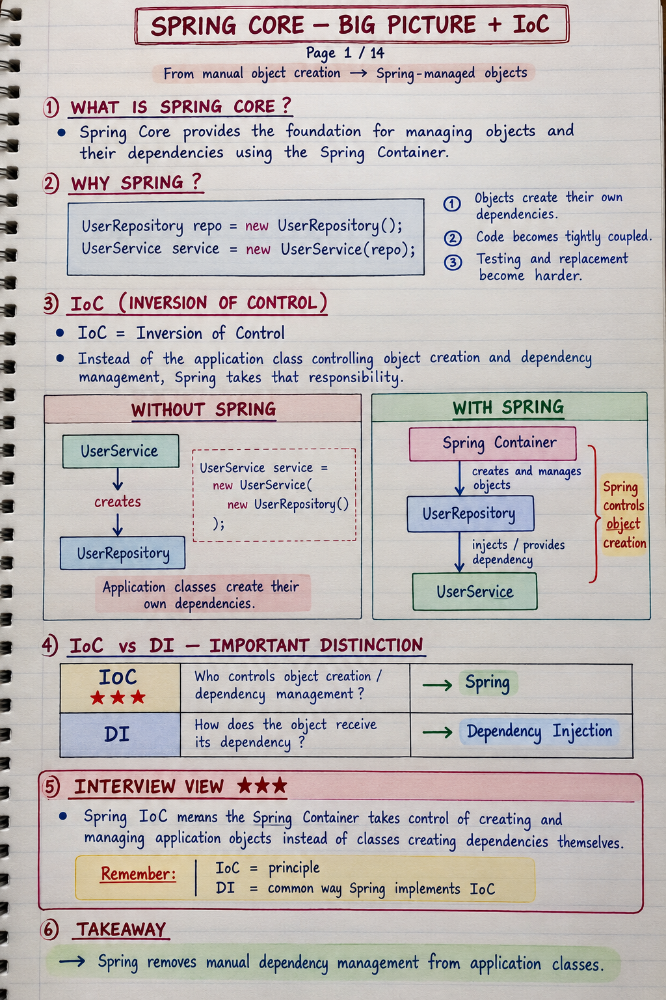 | 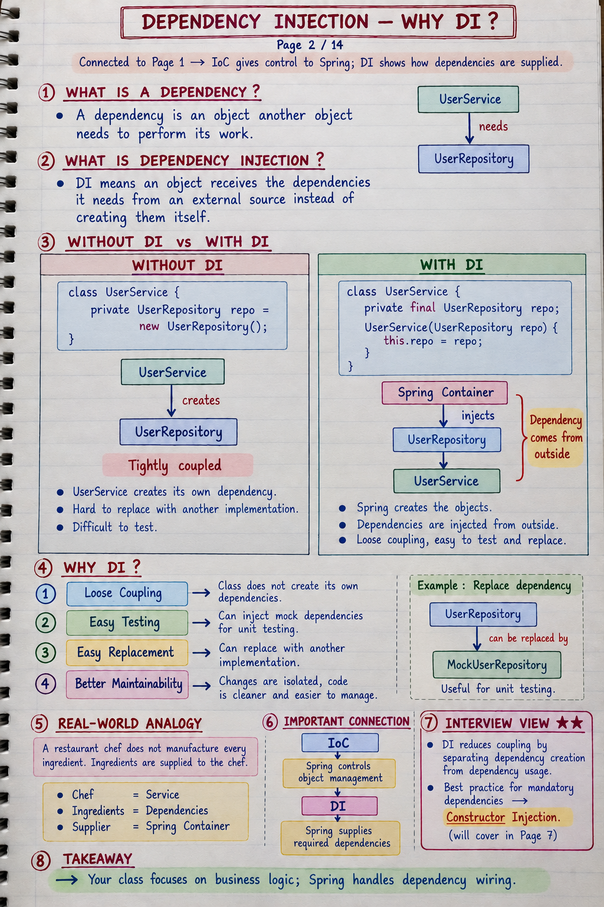 |

| Page 3 | Page 4 |
|:--:|:--:|
| 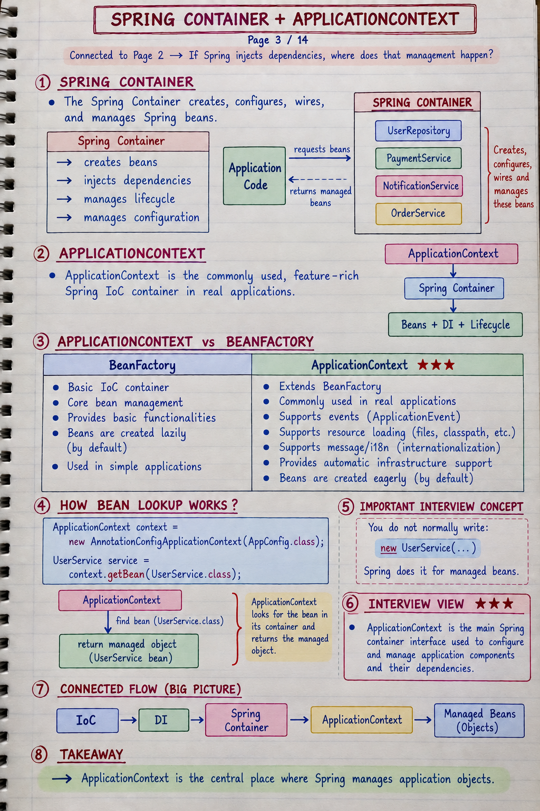 | 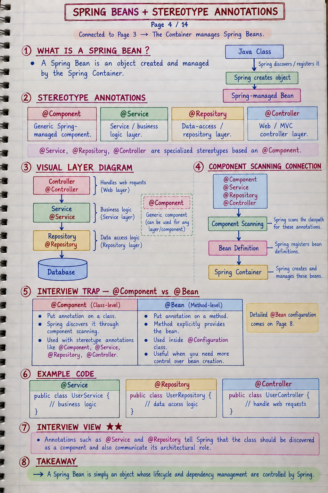 |

| Page 5 | Page 6 |
|:--:|:--:|
| 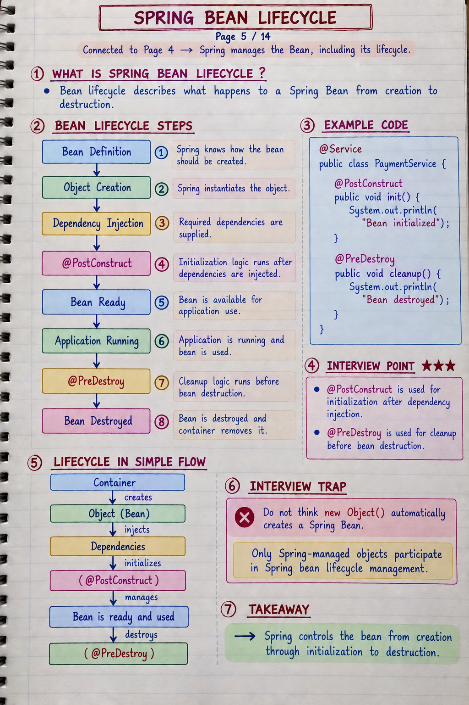 | 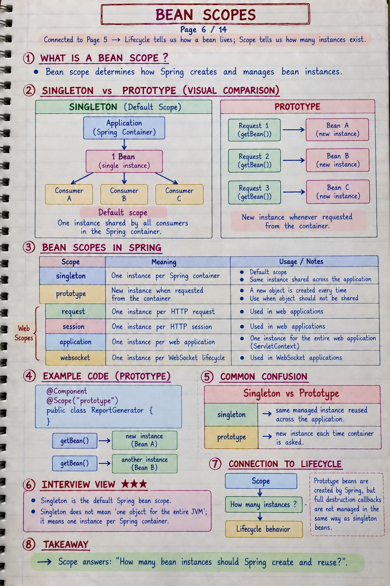 |

| Page 7 | Page 8 |
|:--:|:--:|
| 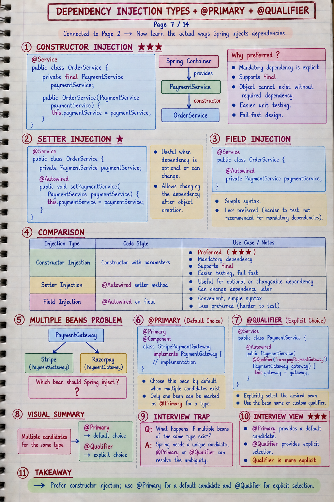 | 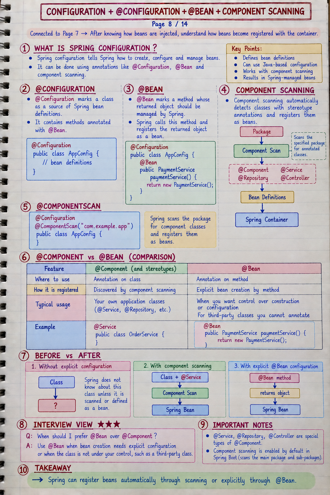 |

| Page 9 | Page 10 |
|:--:|:--:|
| 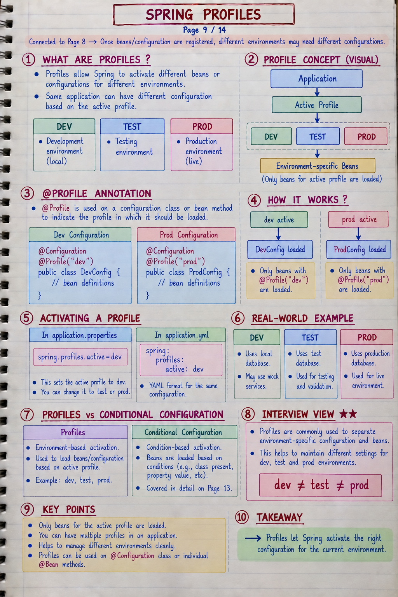 | 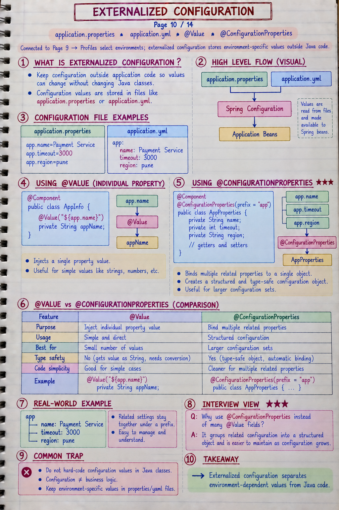 |

| Page 11 |
|:--:|
| 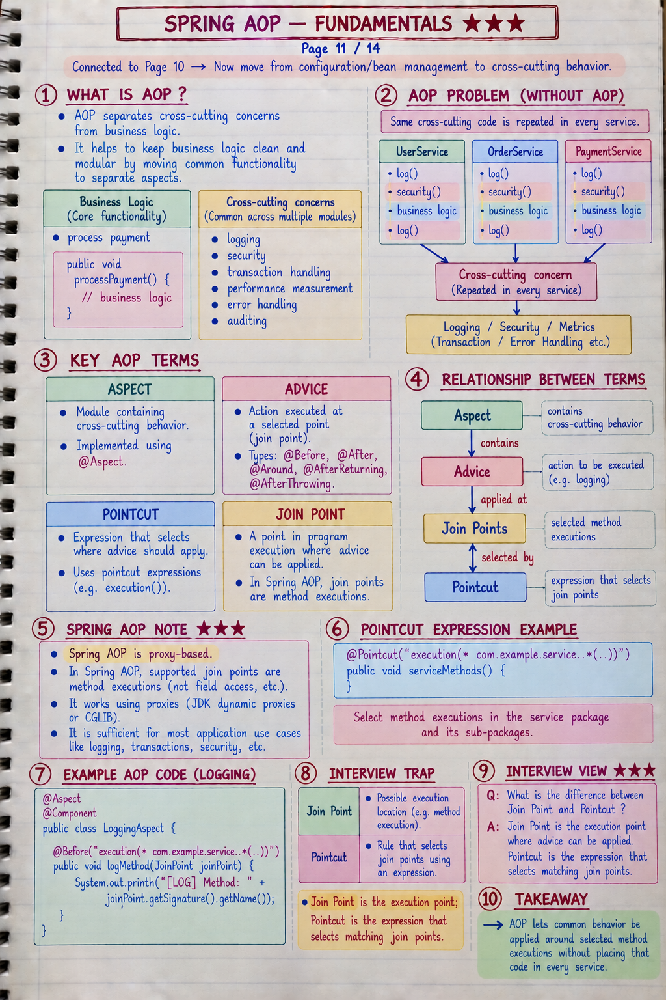 |

---

# Spring Framework — Most Asked Interview Questions & Answers

## 1. What is Spring?

Spring is a **Java framework** used to build enterprise applications. It provides tools that make development easier by handling things like **dependency injection, database connectivity, and application components**. It also supports features like **AOP** and helps developers focus more on business logic. Step-4-Spring-Framework-Level-I…

---

## 2. What are the advantages of the Spring framework?

Spring makes application development easier by managing objects and their dependencies. It supports **transaction management**, integrates well with other technologies, and makes **testing easier**. With **Spring Boot and Spring Cloud**, we can also build and maintain scalable and reliable applications faster. Step-4-Spring-Framework-Level-I…

---

## 3. What are the modules of the Spring framework?

Some important Spring modules are:

- **Core** — object and dependency management
- **AOP** — handles cross-cutting concerns
- **Data Access** — database-related operations
- **Web** — web application development
- **Security** — application security
- **Test** — testing support
- **Messaging, Transactions, and Cloud** — support for specific application needs

Each module focuses on a particular area of application development. Step-4-Spring-Framework-Level-I…

---

## 4. Difference between Spring and Spring Boot?

**Spring** is the main framework that provides features like dependency injection, AOP, and other tools for building Java applications.

**Spring Boot** makes Spring easier to use by providing **auto-configuration, ready-made setups, and an embedded server**. This reduces configuration and helps us start applications quickly. Step-4-Spring-Framework-Level-I…

---

## 5. What is a Spring Bean?

A **Spring Bean** is an object that is **created and managed by the Spring framework**.

Spring takes care of creating, configuring, and managing these objects, which makes it easier for different components of the application to work together. Step-4-Spring-Framework-Level-I…

---

## 6. What is IoC and DI?

**IoC (Inversion of Control)** means that the **Spring container takes control of creating and managing objects** instead of the application doing it manually.

**DI (Dependency Injection)** is a way to implement IoC. Instead of a class creating its dependencies itself, those dependencies are **provided to the class by Spring**.

This makes the code easier to manage, test, and change. Step-4-Spring-Framework-Level-I…

---

## 7. What is the role of the IoC container in Spring?

The **IoC container** is responsible for creating and managing Spring objects, called **beans**.

It also provides the required dependencies to those beans and connects the objects together automatically. Step-4-Spring-Framework-Level-I…

---

## 8. What are the types of IoC containers in Spring?

There are two main IoC containers:

### 1. BeanFactory
It is the basic container that creates and manages beans.

### 2. ApplicationContext
It is a more advanced container that provides additional features like **event handling** and better integration with Spring features.

In most applications, **ApplicationContext** is commonly used. Step-4-Spring-Framework-Level-I…

---

## 9. What is the use of `@Configuration` and `@Bean` annotations in Spring?

`@Configuration` tells Spring that a class contains **bean definitions**.

`@Bean` is used on a method to tell Spring that the object returned by that method should be **managed as a Spring Bean**.

```java
@Configuration
public class AppConfig {

    @Bean
    public MyService myService() {
        return new MyService();
    }
}
```

Spring uses the `@Bean` method to create and manage the bean. Step-4-Spring-Framework-Level-I…

---

## 10. Which is the best way of injecting beans and why?

**Constructor injection** is generally the preferred way.

It ensures that all required dependencies are provided when the object is created. It also makes dependencies clear and makes the class easier to test. Step-4-Spring-Framework-Level-I…

---

## 11. Difference between Constructor Injection and Setter Injection?

### Constructor Injection

Dependencies are provided **when the object is created**.

```java
@Service
public class UserService {

    private final UserRepository repository;

    public UserService(UserRepository repository) {
        this.repository = repository;
    }
}
```

This ensures that required dependencies are available immediately.

### Setter Injection

Dependencies are provided through **setter methods after the object is created**.

It gives more flexibility when a dependency is optional or may need to be changed later. Step-4-Spring-Framework-Level-I…

---

## 12. What are the different bean scopes in Spring?

Bean scope defines **how a bean is created and how long its instance is used**.

The main scopes are:

- **Singleton** — one instance for the Spring application context
- **Prototype** — a new instance each time the bean is requested
- **Request** — one instance per HTTP request
- **Session** — one instance per user session
- **Global Session** — one instance per global session, mainly for special cases such as portlet applications Step-4-Spring-Framework-Level-I…

---

## 13. In which scenario will you use Singleton and Prototype scope?

### Singleton

Use **Singleton** when we want one shared instance throughout the application.

For example, a bean containing common configuration or shared functionality.

### Prototype

Use **Prototype** when we need a **new instance every time the bean is requested**, especially when the object has different state for different operations or uses. Step-4-Spring-Framework-Level-I…

---

## 14. What is the default bean scope in the Spring Framework?

The default bean scope is **Singleton**.

This means Spring creates one bean instance and shares it within the **Spring application context**. Step-4-Spring-Framework-Level-I…

---

## 15. Are Singleton Beans thread-safe?

**No. Singleton beans are not thread-safe by default.**

A singleton bean can be accessed by multiple threads at the same time. So, if the bean contains shared mutable state, we need to handle that carefully using appropriate synchronization or thread-safe data structures. Step-4-Spring-Framework-Level-I…

---

## 16. Can we have multiple Spring configuration files in one project?

Yes, we can have **multiple Spring configuration files**.

This helps us organize bean definitions and configuration based on different modules or responsibilities. These configurations can then be loaded into the application context as required. Step-4-Spring-Framework-Level-I…

---

## 17. Name some of the design patterns used in the Spring Framework.

Some examples are:

- **Singleton Pattern** — Spring's singleton scope allows a single shared bean instance.
- **Factory Pattern** — Spring is responsible for creating bean instances.

These patterns help Spring manage and create objects efficiently. Step-4-Spring-Framework-Level-I…

---

## 18. How does the Prototype scope work?

With **Prototype scope**, Spring creates a **new bean instance every time the bean is requested**.

Unlike Singleton, where the same instance is reused, Prototype gives us a separate instance for each request. This is useful when each operation needs its own object state. Step-4-Spring-Framework-Level-I…

---

## 19. What are Spring Profiles and how do you use them?

**Spring Profiles** allow us to use different configurations for different environments, such as **development, testing, and production**.

We can activate a profile using:

```properties
spring.profiles.active=dev
```

We can also use the `@Profile` annotation to make specific beans available only for a particular profile. Step-4-Spring-Framework-Level-I…

---

## 20. What is Spring WebFlux and how is it different from Spring MVC?

**Spring WebFlux** is a part of Spring that supports **reactive programming** using Project Reactor.

The main difference is:

- **Spring MVC** — traditional synchronous, blocking model
- **Spring WebFlux** — asynchronous, non-blocking, reactive model

WebFlux is useful for applications that need **high concurrency with efficient resource usage**. Step-4-Spring-Framework-Level-I…

---

## 21. You are starting a new Spring project. What factors would you consider when deciding between using annotations and XML for configuring your beans?

I would mainly consider **team familiarity, project requirements, and configuration complexity**.

**Annotations** are usually more concise and easier to maintain because the configuration stays close to the code.

**XML** keeps configuration separate from the code and can be useful when we need to change configuration without modifying the source code. Step-4-Spring-Framework-Level-I…

---

## 22. You have a large Spring project with many interdependent beans. How would you manage the dependencies to maintain clean code and reduce coupling?

I would:

- Use **Dependency Injection** to manage dependencies.
- Use **Spring Profiles** for environment-specific configuration.
- Group related beans into separate **configuration classes**.
- Use **`@ComponentScan`** to automatically discover beans. Step-4-Spring-Framework-Level-I…

---

## 23. You have a singleton bean that needs to be thread-safe. What approaches would you take to ensure its thread safety?

I would:

- Use **synchronized methods or blocks** for critical sections.
- Use **ThreadLocal** when thread-specific data is required.
- Prefer **stateless beans** where possible, so there is less shared mutable state.
- Use thread-safe utilities from **`java.util.concurrent`**. Step-4-Spring-Framework-Level-I…