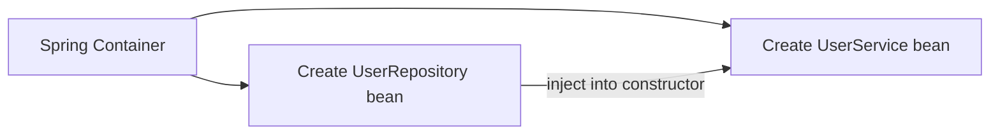

# Spring Core Notes — Interview-Focused

> Scope: Spring Core concepts most useful for 3–5 YOE Java Backend / Spring Boot interviews. AOP is intentionally excluded.

## Mental Model First

```text
IoC (Spring controls object creation)
    ↓
DI (Spring supplies required objects)
    ↓
Spring Container (BeanFactory / ApplicationContext)
    ↓
Beans (objects managed by Spring)
    ↓
Stereotypes and configuration (@Service, @Repository, @Bean)
    ↓
Configuration and environments (profiles, properties, YAML)
```

In a typical backend application:

```text
HTTP request
    ↓
Controller → Service → Repository → Database
                 ↑          ↑
          Spring injects dependencies
```

---

## 1. 🔥 IoC and Dependency Injection

### What is IoC?

**Inversion of Control (IoC)** means your application does not create and wire every object itself. Spring takes that responsibility. You describe the objects and their relationships; the Spring container creates and manages them.

### What is Dependency Injection (DI)?

**Dependency Injection** means Spring gives a class the objects it needs. For example, `UserService` needs `UserRepository`; Spring creates both and passes the repository to the service.

### Why do we need them?

Without DI, classes create their own dependencies. That makes code tightly coupled and hard to test or replace.

```java
// Tight coupling: UserService decides which repository implementation to use.
class UserService {
    private final UserRepository repository = new JpaUserRepository();
}
```

With DI, the class only states what it needs. Spring decides how to provide it.

```java
@Service
class UserService {
    private final UserRepository repository;

    UserService(UserRepository repository) {
        this.repository = repository;
    }
}
```

### How does it work?

```text
1. Spring starts and finds configuration / component classes.
2. It creates beans such as UserRepository.
3. It sees UserService needs UserRepository.
4. It injects that bean through the constructor.
5. It keeps the managed beans in the container.
```



### Real-world example

A payment service needs a payment gateway client. In production, inject a real client. In a unit test, inject a fake or mocked client. `PaymentService` does not need to change.

### ⭐ Interview Points

- IoC is the broad principle: Spring controls object creation and lifecycle.
- DI is a common way Spring implements IoC.
- DI reduces coupling and improves testability, maintainability, and replacement of implementations.
- In Spring, dependencies are usually injected by constructor.

### ⚠️ Common Mistakes / Traps

- IoC and DI are related, but not exactly the same. **IoC is the principle; DI is the technique.**
- DI does not mean every class must be a Spring bean. Keep simple data objects and domain objects as normal Java objects when appropriate.

### 🎯 Interview Questions

**Q: What is Dependency Injection?**

> Dependency Injection means Spring provides the dependencies a class needs instead of the class creating them itself. It keeps classes loosely coupled and makes them easier to test and maintain.

**Q: What is IoC in Spring?**

> IoC means control of object creation and wiring is moved from application code to the Spring container. The container creates, configures, and manages beans.

### IoC vs DI

| IoC | DI |
|---|---|
| Design principle | A way to implement the principle |
| Spring controls object creation | Spring supplies dependencies to an object |
| Broader concept | More specific concept |

---

## 2. 🔥 Spring IoC Container and `ApplicationContext`

### What is it?

The **Spring IoC container** is the part of Spring that creates, configures, wires, and manages beans. In everyday Spring Boot code, you mostly interact with it through an `ApplicationContext`.

### Why do we need it?

It provides one central place to manage object creation, dependency wiring, configuration, lifecycle callbacks, and application-level features.

### How does it work?

```text
SpringApplication.run(...)
        ↓
Creates ApplicationContext
        ↓
Reads configuration and scans components
        ↓
Builds bean definitions
        ↓
Creates and wires beans
        ↓
Application is ready
```

```java
@SpringBootApplication
public class StoreApplication {
    public static void main(String[] args) {
        SpringApplication.run(StoreApplication.class, args);
    }
}
```

`@SpringBootApplication` includes configuration and component-scanning support. Spring Boot then creates an appropriate `ApplicationContext` for the application type.

### Real-world example

At startup, the context creates a controller, a service, a repository, a datasource, and other configured beans. It injects the repository into the service and the service into the controller.

### ⭐ Interview Points

- The container manages bean creation, dependency injection, lifecycle, and scopes.
- `ApplicationContext` is the commonly used, feature-rich Spring container interface.
- Avoid manually calling `context.getBean()` in business code; prefer normal DI.

### 🎯 Interview Questions

**Q: What is `ApplicationContext`?**

> It is Spring's feature-rich IoC container. It manages beans and also provides features such as configuration resolution, events, resource loading, and internationalization.

---

## 3. ⭐ `BeanFactory` vs `ApplicationContext`

### What are they?

Both are IoC container interfaces. `BeanFactory` provides basic bean management. `ApplicationContext` extends it and adds enterprise/application features. Spring Boot applications normally use an `ApplicationContext`.

| Feature | `BeanFactory` | `ApplicationContext` |
|---|---|---|
| Basic bean creation and lookup | Yes | Yes |
| Dependency injection | Yes | Yes |
| Usually creates singleton beans eagerly at startup | No, commonly lazy | Yes, by default |
| Application events | No | Yes |
| Internationalization (i18n) | No | Yes |
| Resource loading | Basic / limited use | Yes |
| Used directly in Spring Boot apps | Rarely | Commonly |

### Why does the difference matter?

`ApplicationContext` gives an application the extra infrastructure it normally needs. `BeanFactory` is the lower-level foundation.

### ⚠️ Interview Trap

Do not say `BeanFactory` can never create a bean until requested. It supports lazy-style lookup, but exact creation timing can depend on bean configuration and usage. The useful interview distinction is that `ApplicationContext` adds application-level features and is the standard choice.

### 🎯 Interview Questions

**Q: Which one is used in Spring Boot?**

> Spring Boot normally creates an `ApplicationContext`. `BeanFactory` is the base container abstraction, while `ApplicationContext` adds the features a typical application needs.

---

## 4. 🔥 Spring Beans

### What is a bean?

A **Spring bean** is an object that the Spring container creates and manages. It is not just any Java object; Spring knows about its definition, lifecycle, scope, and dependencies.

### How can a bean be created?

- Component scanning: `@Component`, `@Service`, `@Repository`, `@Controller`
- Java configuration: a method annotated with `@Bean`
- XML configuration: legacy approach; know it exists, but it is uncommon in modern Spring Boot applications

```java
@Component
class EmailSender {
    void send(String message) {
        // send email
    }
}
```

```java
@Configuration
class MessagingConfig {
    @Bean
    Clock clock() {
        return Clock.systemUTC();
    }
}
```

### Bean name

By default, Spring commonly uses the class name with a lowercase first letter, such as `userService`. A `@Bean` method name is the default bean name, such as `clock`.

### ⭐ Interview Points

- A bean is managed by Spring; a normal object is created and managed by your code.
- Beans can have dependencies, scopes, initialization, and destruction callbacks.
- A bean is not necessarily a singleton class; scope determines how many instances Spring creates.

### 🎯 Interview Questions

**Q: What is the difference between a bean and an object?**

> Every bean is an object, but not every object is a Spring bean. A bean is an object created and managed by the Spring container, so Spring can inject dependencies and manage its lifecycle.

---

## 5. 🔥 Component Stereotypes: `@Component`, `@Service`, `@Repository`, `@Controller`

### What are they?

These annotations mark classes for component scanning, so Spring can register them as beans. `@Service`, `@Repository`, and `@Controller` are specialized forms of `@Component` that communicate the class's role.

| Annotation | Typical layer | Why use it? |
|---|---|---|
| `@Component` | Generic infrastructure/helper | General-purpose Spring-managed class |
| `@Service` | Business logic | Makes service-layer intent clear |
| `@Repository` | Persistence/data access | Signals repository role; participates in persistence exception translation |
| `@Controller` | Web MVC | Handles web requests and returns a view or response handling flow |
| `@RestController` | REST API | `@Controller` + `@ResponseBody`; usually used for JSON APIs |

```java
@Repository
class UserRepository {
    Optional<User> findById(UUID id) {
        // query database
        return Optional.empty();
    }
}

@Service
class UserService {
    private final UserRepository userRepository;

    UserService(UserRepository userRepository) {
        this.userRepository = userRepository;
    }
}
```

### Why use specific stereotypes instead of only `@Component`?

They make architecture easier to read and give some layers special meaning. For example, `@Repository` can translate persistence technology exceptions into Spring's data-access exception hierarchy when the relevant infrastructure is configured.

### ⚠️ Interview Trap

- `@Service` does not magically add business logic behavior by itself; its main benefit is clear intent and consistent architecture.
- Do not mark every class as `@Component`. Use the most meaningful stereotype.

### 🎯 Interview Questions

**Q: What is the difference between `@Component` and `@Service`?**

> Both make a class eligible for component scanning. `@Service` is a specialized `@Component` used to show that the class contains business logic. It improves readability and layer separation.

---

## 6. 🔥 Dependency Injection Styles

### Constructor injection — preferred

```java
@Service
class OrderService {
    private final PaymentClient paymentClient;
    private final OrderRepository orderRepository;

    OrderService(PaymentClient paymentClient, OrderRepository orderRepository) {
        this.paymentClient = paymentClient;
        this.orderRepository = orderRepository;
    }
}
```

When there is only one constructor, modern Spring automatically uses it; `@Autowired` is not required.

### Setter injection — for optional or changeable dependencies

```java
@Component
class ReportExporter {
    private Formatter formatter = Formatter.defaultFormatter();

    @Autowired
    void setFormatter(Formatter formatter) {
        this.formatter = formatter;
    }
}
```

Use it sparingly. The bean can exist briefly before the setter runs, so required dependencies are less obvious.

### Field injection — avoid in production code

```java
@Service
class LegacyOrderService {
    @Autowired
    private OrderRepository orderRepository;
}
```

It is concise, but dependencies are hidden, fields cannot easily be `final`, and unit tests usually need reflection or a Spring test context.

| Style | Best use | Main benefit | Main concern |
|---|---|---|---|
| Constructor | Required dependencies | Immutable, clear, testable | Long constructor may reveal too many responsibilities |
| Setter | Truly optional dependency | Can be changed/configured | Object can be incomplete |
| Field | Usually avoid | Short syntax | Hidden dependency and harder unit testing |

### ⭐ Interview Points

- Prefer constructor injection for required dependencies.
- It supports `final` fields and makes a valid object easier to guarantee.
- A very large constructor often signals that the class has too many responsibilities; consider refactoring.

### 🎯 Interview Questions

**Q: Why do you prefer constructor injection?**

> Constructor injection makes required dependencies explicit and allows them to be `final`. It makes the class easier to unit test without Spring and prevents creating the class in an incomplete state.

---

## 7. 🔥 Bean Lifecycle

### What is it?

The bean lifecycle is the sequence Spring follows to create, configure, initialize, use, and eventually destroy a bean.

### Simplified lifecycle

```text
1. Instantiate bean
2. Inject dependencies / set properties
3. Run initialization callbacks
4. Bean is ready for use
5. On context shutdown, run destruction callbacks
```

```mermaid
flowchart LR
    A[Instantiate] --> B[Inject dependencies]
    B --> C[@PostConstruct / init method]
    C --> D[Bean ready]
    D --> E[Context shutdown]
    E --> F[@PreDestroy / destroy method]
```

### Simple example

```java
@Component
class CacheWarmup {
    @PostConstruct
    void loadInitialCache() {
        // Run once after dependencies are injected.
    }

    @PreDestroy
    void closeResources() {
        // Release resources during graceful shutdown.
    }
}
```

> In Spring Framework 6 / Spring Boot 3, `@PostConstruct` and `@PreDestroy` come from `jakarta.annotation`, not `javax.annotation`.

### Why do we need lifecycle callbacks?

They provide a clear place for setup that needs injected dependencies, and cleanup for resources such as clients or executors that need explicit closing.

### Other lifecycle options

- `@PostConstruct` / `@PreDestroy`: readable and common for simple callbacks
- `@Bean(initMethod = "...", destroyMethod = "...")`: useful for third-party classes you cannot annotate
- `InitializingBean` / `DisposableBean`: Spring-specific interfaces; usually less preferred because they couple code to Spring
- `BeanPostProcessor`: advanced container extension point; know the name, but it is not needed for most application code

### ⚠️ Common Mistakes / Traps

- `@PostConstruct` runs after dependency injection, not necessarily after the whole application is fully ready. For actions that require the fully started application, consider an application-ready event.
- Destruction callbacks are reliable for singleton beans during normal context shutdown. Spring does **not** manage the full destruction lifecycle of prototype beans.
- Avoid expensive network calls or business workflows in `@PostConstruct`; they can slow or fail startup.

### 🎯 Interview Questions

**Q: When is `@PostConstruct` called?**

> It is called after Spring creates the bean and injects its dependencies, during bean initialization. It is useful for lightweight setup that depends on injected fields or constructor dependencies.

**Q: When is `@PreDestroy` called?**

> It is called when the Spring context shuts down, typically for singleton beans. I use it to release resources gracefully, such as closing a client or stopping a local executor.

---

## 8. ⭐ Bean Scopes: Singleton and Prototype

### What is a bean scope?

Scope controls how many bean instances Spring creates and how long they live.

| Scope | Meaning | Typical use |
|---|---|---|
| `singleton` | One instance per Spring container; default | Stateless services, repositories, controllers |
| `prototype` | New instance every time it is requested from the container | Stateful, short-lived helper objects (uncommon) |
| `request` | One instance per HTTP request | Web request-specific state |
| `session` | One instance per HTTP session | Session-specific state; use carefully |
| `application` | One instance per web application context | Web-app-wide state |

### Singleton example

```java
@Service // default scope is singleton
class ProductService {
}
```

### Prototype example

```java
@Component
@Scope(ConfigurableBeanFactory.SCOPE_PROTOTYPE)
class CsvRowProcessor {
}
```

### Singleton vs prototype

| Singleton | Prototype |
|---|---|
| One bean instance per container | New instance for each container request |
| Default scope | Explicitly configured |
| Spring handles destruction callbacks | Spring creates it but does not fully manage destruction |
| Must usually be stateless/thread-safe | Can hold short-lived state |

### ⚠️ Interview Trap: singleton does not mean one JVM-wide object

Spring singleton means **one instance per Spring `ApplicationContext`**, not necessarily one instance in the whole JVM. Multiple contexts can each have their own instance.

### ⚠️ Interview Trap: prototype injected into singleton

If a prototype bean is constructor-injected into a singleton bean, it is resolved once when the singleton is created. The singleton will keep that same instance. Use a provider, scoped proxy, or redesign if a fresh prototype is truly required each time.

### 🎯 Interview Questions

**Q: Is a Spring singleton thread-safe?**

> No. Singleton scope only controls the number of instances. Because one instance can serve many requests, singleton beans should usually be stateless or explicitly made thread-safe.

---

## 9. 🔥 `@Configuration` and `@Bean`

### What are they?

`@Configuration` marks a class that declares bean definitions. `@Bean` marks a method whose returned object should be managed as a Spring bean.

```java
@Configuration
class AppConfig {

    @Bean
    Clock clock() {
        return Clock.systemUTC();
    }

    @Bean
    TokenService tokenService(Clock clock) {
        return new TokenService(clock);
    }
}
```

Spring injects the `Clock` bean into the `tokenService` method, then registers the returned `TokenService` as a bean.

### Why do we need `@Bean` when we have `@Component`?

Use `@Component` when you own the class and it naturally belongs to component scanning. Use `@Bean` when:

- The class comes from a third-party library and cannot be annotated.
- Construction needs custom logic.
- You want configuration in one explicit place.

```java
@Configuration
class HttpClientConfig {
    @Bean
    HttpClient billingHttpClient() {
        return HttpClient.newBuilder()
                .connectTimeout(Duration.ofSeconds(2))
                .build();
    }
}
```

### ⚠️ Interview Trap

`@Configuration` is more than a label in standard configuration mode: Spring enhances it so calls between `@Bean` methods can preserve container-managed bean semantics. Do not casually replace it with a plain class when that behavior matters. In modern Spring, `@Bean` methods can also be declared in other component classes, but a dedicated `@Configuration` class is clearer for application configuration.

### 🎯 Interview Questions

**Q: When would you use `@Bean` instead of `@Component`?**

> I use `@Bean` when I need to register an object whose source I do not control, such as a third-party client, or when its creation needs custom configuration. I use `@Component`-style annotations for my own application classes.

---

## 10. ⭐ `@ComponentScan`

### What is it?

`@ComponentScan` tells Spring where to search for component classes such as `@Service`, `@Repository`, and `@Controller`.

```java
@Configuration
@ComponentScan(basePackages = "com.example.store")
class AppConfig {
}
```

In Spring Boot, `@SpringBootApplication` includes component scanning. By convention, put the main application class in a root package above the application's other packages.

```text
com.example.store
├── StoreApplication.java        ← root package
├── api
│   └── ProductController.java
├── service
│   └── ProductService.java
└── repository
    └── ProductRepository.java
```

### ⚠️ Common Mistake

If `StoreApplication` is placed in a narrow subpackage, Spring may not scan sibling packages. The result is often a `NoSuchBeanDefinitionException` or an unsatisfied dependency error at startup.

### 🎯 Interview Questions

**Q: How does Spring find `@Service` classes?**

> Component scanning searches configured packages for stereotype annotations. In Spring Boot, `@SpringBootApplication` enables scanning from the package of the main application class and its subpackages by default.

---

## 11. 🔥 Multiple Implementations: `@Primary` and `@Qualifier`

### The problem

When Spring finds two beans of the same type, it cannot safely guess which one to inject.

```java
interface NotificationSender {
    void send(String message);
}

@Service
class EmailNotificationSender implements NotificationSender { /* ... */ }

@Service
class SmsNotificationSender implements NotificationSender { /* ... */ }
```

Injecting only `NotificationSender` now causes ambiguity.

### `@Primary`: default choice

```java
@Service
@Primary
class EmailNotificationSender implements NotificationSender { /* ... */ }
```

Spring uses the primary bean when it needs one `NotificationSender` and no more specific instruction is present.

### `@Qualifier`: explicit choice

```java
@Service("smsSender")
class SmsNotificationSender implements NotificationSender { /* ... */ }

@Service
class AlertService {
    private final NotificationSender notificationSender;

    AlertService(@Qualifier("smsSender") NotificationSender notificationSender) {
        this.notificationSender = notificationSender;
    }
}
```

### How to choose

| `@Primary` | `@Qualifier` |
|---|---|
| Declares the usual/default implementation | Requests a particular implementation at an injection point |
| Good when one choice is broadly preferred | Good when the exact choice matters |
| Can be overridden by a qualifier | Takes precedence for that injection point |

### ⚠️ Common Mistake

Do not use `@Primary` simply to hide a design problem. If a service genuinely needs different implementations in different situations, select them explicitly or use a small strategy/factory abstraction.

### 🎯 Interview Questions

**Q: What happens when there are multiple beans of the same type?**

> Spring throws a `NoUniqueBeanDefinitionException` unless it can resolve the ambiguity. I can use `@Primary` to define the default bean or `@Qualifier` to request a specific bean.

---

## 12. 🔥 Spring Profiles

### What are profiles?

Profiles allow different beans or configuration to be active in different environments, such as local development, test, staging, and production.

```java
@Configuration
@Profile("dev")
class DevStorageConfig {
    @Bean
    StorageClient storageClient() {
        return new LocalStorageClient();
    }
}

@Configuration
@Profile("prod")
class ProductionStorageConfig {
    @Bean
    StorageClient storageClient() {
        return new CloudStorageClient();
    }
}
```

### How to activate a profile

```properties
# application.properties
spring.profiles.active=dev
```

For deployment, prefer setting an environment variable or command-line argument instead of committing a production choice into source-controlled defaults:

```text
SPRING_PROFILES_ACTIVE=prod
```

### Profile-specific config files

```text
application.yml        # shared defaults
application-dev.yml    # development overrides
application-prod.yml   # production overrides
```

### ⭐ Interview Points

- Profiles control which beans and configuration are active for an environment.
- Keep secrets out of source-controlled profile files; inject them through a secure external source.
- A profile is not a security boundary. It is a configuration mechanism.

### 🎯 Interview Questions

**Q: How do you keep dev and prod configuration different?**

> I use profile-specific configuration files and, when needed, `@Profile` beans. The deployment environment activates the appropriate profile, while secrets come from external secure configuration rather than the repository.

---

## 13. ⭐ `application.properties` and `application.yml`

### What are they?

They are common Spring Boot configuration files. Spring Boot reads them and makes properties available through its externalized configuration system.

### Properties format

```properties
app.mail.host=smtp.example.com
app.mail.port=587
app.mail.timeout=2s
```

### YAML format

```yaml
app:
  mail:
    host: smtp.example.com
    port: 587
    timeout: 2s
```

### Which should you use?

Both work. YAML is often easier to read for nested configuration; `.properties` is simple and familiar. Use one style consistently in a project where possible.

### ⚠️ Common Mistakes

- YAML indentation matters; use spaces, not tabs.
- Do not put passwords, API keys, or private tokens directly in committed config files.
- `application.properties` / YAML are Spring Boot conventions. Spring Framework itself does not require Spring Boot's externalized configuration mechanism.

---

## 14. 🔥 Externalized Configuration

### What is it?

Externalized configuration means configuration values are outside compiled Java code, so the same application artifact can run differently in local, test, and production environments.

Examples: database URL, timeout, log level, feature flag, external service endpoint.

### Why do we need it?

Hard-coding environment values requires a new build or code change for each environment and risks exposing secrets.

```text
Code:       "Call a payment service"
Config:     payment base URL, timeout, credentials
Environment: dev / test / production values
```

### Common configuration sources

Spring Boot can combine values from sources such as:

- Packaged `application.properties` or `application.yml`
- Profile-specific files
- Environment variables
- Command-line arguments
- External configuration files
- Environment-specific secret/configuration services

Higher-priority sources can override lower-priority values. The exact order is documented by the Spring Boot version, so check your application's version when debugging an override.

### Relaxed binding

Spring Boot maps common naming styles to the same logical property:

```text
app.mail.connect-timeout
app.mail.connectTimeout
APP_MAIL_CONNECT_TIMEOUT
```

This is especially useful because environment variables commonly use uppercase and underscores.

### 🎯 Interview Questions

**Q: What is externalized configuration?**

> It means keeping environment-specific values outside Java code. The same application build can use different database URLs, timeouts, and credentials in different environments through properties, environment variables, or other configuration sources.

---

## 15. ⭐ `@Value`

### What is it?

`@Value` injects an individual configuration value into a bean.

```java
@Component
class WelcomeMessageService {
    private final String message;

    WelcomeMessageService(@Value("${app.welcome-message}") String message) {
        this.message = message;
    }
}
```

```properties
app.welcome-message=Welcome to the store
```

You can supply a default when a property is absent:

```java
@Value("${app.request-timeout:2s}")
private Duration requestTimeout;
```

### When should you use it?

Use it for one or two simple values. For a related group of settings, prefer `@ConfigurationProperties`.

### ⚠️ Common Mistakes / Traps

- A typo in a property key can fail startup unless a default is supplied.
- Do not spread many `@Value` fields throughout a large class; it becomes hard to validate and test.
- Constructor injection with `@Value` keeps the value explicit and supports immutable fields.

---

## 16. 🔥 `@ConfigurationProperties`

### What is it?

`@ConfigurationProperties` binds a group of related configuration values to a typed Java class. It is the preferred approach for non-trivial application configuration.

```yaml
app:
  mail:
    host: smtp.example.com
    port: 587
    username: notifier
    timeout: 2s
```

```java
@ConfigurationProperties(prefix = "app.mail")
public record MailProperties(
        String host,
        int port,
        String username,
        Duration timeout) {
}
```

Enable scanning in a Spring Boot application:

```java
@SpringBootApplication
@ConfigurationPropertiesScan
public class StoreApplication {
}
```

Then inject the typed config normally:

```java
@Service
class MailService {
    private final MailProperties properties;

    MailService(MailProperties properties) {
        this.properties = properties;
    }
}
```

### Why do we need it?

It groups related settings, supports type conversion (for example, `2s` to `Duration`), and keeps configuration separate from business logic.

### Validation example

With a Bean Validation implementation on the classpath, use `@Validated` and constraints:

```java
@Validated
@ConfigurationProperties(prefix = "app.mail")
public record MailProperties(
        @NotBlank String host,
        @Min(1) int port,
        @NotNull Duration timeout) {
}
```

This lets the application fail early with a clear message when required configuration is invalid.

### `@Value` vs `@ConfigurationProperties`

| `@Value` | `@ConfigurationProperties` |
|---|---|
| One individual value | A related group of values |
| Quick for simple use | Better structure for application settings |
| Supports property expressions | Supports typed, grouped binding and validation |
| Can become scattered | Centralized and easier to test |

### 🎯 Interview Questions

**Q: When would you choose `@ConfigurationProperties` over `@Value`?**

> I use `@Value` for a small number of simple values. For related settings such as mail, payment, or client configuration, I use `@ConfigurationProperties` because it is typed, grouped, easier to validate, and cleaner to maintain.

---

## 17. 🔥 Basic Bean Creation and DI Flow

Use this flow to explain what happens when a Spring Boot application starts.

```text
1. main() calls SpringApplication.run().
2. Spring Boot creates an ApplicationContext.
3. It reads configuration, auto-configuration metadata, and component-scan packages.
4. It registers bean definitions for discovered/configured beans.
5. It creates singleton beans (normally at startup).
6. For each bean, it resolves constructor dependencies.
7. It injects dependencies, then runs initialization callbacks.
8. The application begins serving requests.
9. On graceful shutdown, destruction callbacks run for managed singleton beans.
```

Example dependency chain:

```java
@Repository
class OrderRepository {
}

@Service
class OrderService {
    private final OrderRepository orderRepository;

    OrderService(OrderRepository orderRepository) {
        this.orderRepository = orderRepository;
    }
}

@RestController
@RequestMapping("/orders")
class OrderController {
    private final OrderService orderService;

    OrderController(OrderService orderService) {
        this.orderService = orderService;
    }
}
```

```text
Spring finds OrderRepository, OrderService, OrderController
        ↓
Creates OrderRepository
        ↓
Creates OrderService and injects OrderRepository
        ↓
Creates OrderController and injects OrderService
        ↓
Application is ready to route /orders requests
```

### ⚠️ Circular dependencies

If `A` needs `B` and `B` needs `A`, Spring cannot construct a clean dependency graph. Constructor injection exposes this immediately.

```text
OrderService → PaymentService
PaymentService → OrderService   ← circular dependency
```

Usually this is a design smell. Extract shared work into another service or redesign responsibilities instead of working around it.

### 🎯 Interview Questions

**Q: How does Spring inject dependencies?**

> During bean creation, Spring looks at the bean's constructor or other injection points, finds matching beans in the application context, and supplies them. After dependencies are set, it runs initialization callbacks and keeps the bean ready for use.

---

## 18. 💡 Spring vs Spring Boot

This is useful context for interviews, even though these notes focus on Spring Core.

| Spring Framework | Spring Boot |
|---|---|
| Core framework for DI, IoC, web, data integration, and more | Opinionated layer that makes Spring applications faster to create |
| You configure more explicitly | Provides auto-configuration and sensible defaults |
| Can be used without Boot | Built on top of Spring Framework |
| No required embedded server setup | Commonly runs with embedded server support for web apps |

**Natural answer:**

> Spring Framework provides the core features such as IoC and dependency injection. Spring Boot builds on it and reduces setup through auto-configuration, starter dependencies, and production-friendly defaults.

---

# Spring Core — Quick Interview Revision

## Top Concepts

1. **IoC and DI** — Spring creates and wires objects instead of application code doing it everywhere.
2. **ApplicationContext** — the main, feature-rich Spring container.
3. **Beans** — objects managed by Spring.
4. **Constructor injection** — preferred for required dependencies.
5. **Component stereotypes** — use `@Service`, `@Repository`, and controllers to express architecture.
6. **Bean lifecycle and scopes** — know default singleton behavior and lifecycle callbacks.
7. **`@Configuration` / `@Bean`** — explicit bean registration, especially for third-party objects.
8. **`@Primary` / `@Qualifier`** — resolve multiple implementations.
9. **Profiles and external configuration** — run the same build safely across environments.
10. **`@ConfigurationProperties`** — typed, grouped configuration binding.

## Top Interview Questions

- What are IoC and Dependency Injection? How are they different?
- What is the Spring IoC container?
- What is the difference between `BeanFactory` and `ApplicationContext`?
- What is a Spring bean?
- Why is constructor injection preferred?
- What is the difference between `@Component`, `@Service`, and `@Repository`?
- Explain the bean lifecycle. When do `@PostConstruct` and `@PreDestroy` run?
- What is the default bean scope? Is singleton scope thread-safe?
- What is the difference between singleton and prototype scope?
- When would you use `@Bean` rather than `@Component`?
- How do `@Primary` and `@Qualifier` resolve ambiguity?
- How do Spring profiles work?
- What is externalized configuration?
- When should you use `@Value` vs `@ConfigurationProperties`?

## Must-Remember Cheat Sheet

```text
IoC                     → Spring controls object creation and lifecycle
DI                      → Spring provides a class's dependencies
Bean                    → Object managed by the Spring container
ApplicationContext      → Main feature-rich IoC container
BeanFactory             → Lower-level bean container abstraction
Default bean scope      → Singleton (one per ApplicationContext)
Singleton safety        → Not automatically thread-safe; keep it stateless
Preferred injection     → Constructor injection
@Component              → Generic scanned component
@Service                → Business-layer component
@Repository             → Data-access component; supports exception translation
@Controller             → MVC web controller
@RestController         → REST controller returning response bodies
@PostConstruct          → Run after dependency injection
@PreDestroy             → Run during normal context shutdown
@Configuration          → Class containing bean definitions
@Bean                   → Method return value becomes a managed bean
@ComponentScan          → Finds stereotype-annotated classes
@Primary                → Default bean among same-type candidates
@Qualifier              → Requests a named/specific candidate
@Profile                → Activates beans for selected environment(s)
@Value                  → Injects an individual property
@ConfigurationProperties → Binds a related, typed group of properties
Externalized config     → Environment values outside Java code
```

## 30-Second Spring Core Explanation

> Spring Core is mainly about IoC and Dependency Injection. Spring's `ApplicationContext` creates and manages beans, resolves their dependencies, and controls their lifecycle. In a typical Spring Boot application, components such as controllers, services, and repositories are discovered by scanning, wired with constructor injection, and configured through external properties and profiles.
